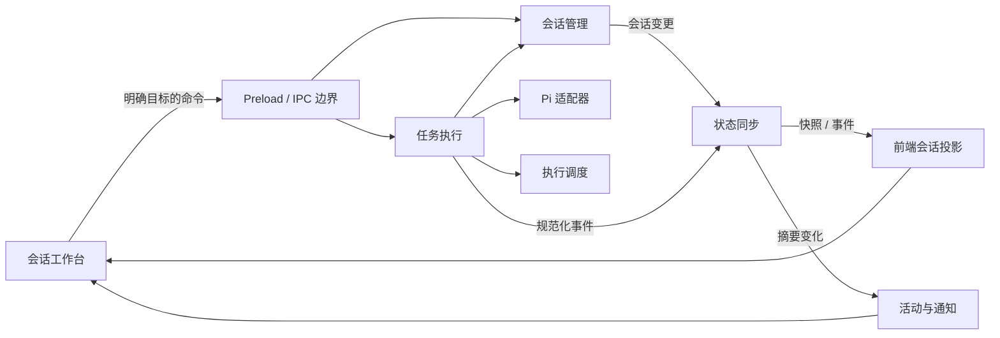
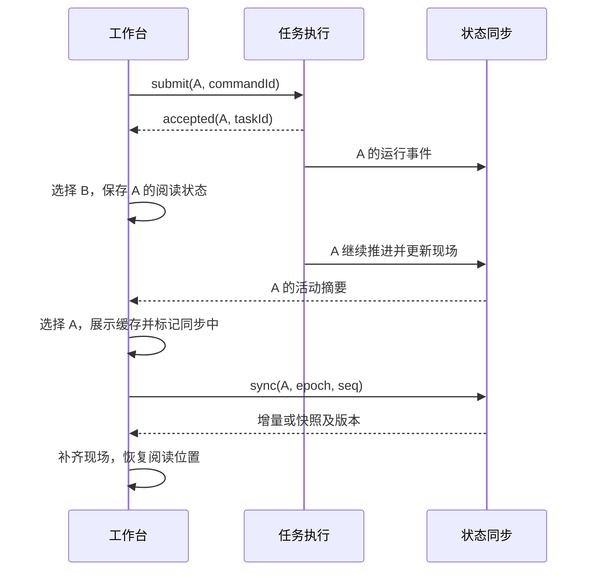

# Desktop 多会话架构设计

状态：设计草案，尚未实施

日期：2026-09-07

体验契约：[spec.md](spec.md)

历史调查：[会话模型隔离与切换问题记录](model-and-session-isolation-spec.md)

## 1. 设计结论

采用应用内模块化架构：主进程拥有会话、任务和可恢复运行现场；前端拥有导航与阅读交互，通过带版本的快照和事件维护投影。

**会话选择、任务执行、界面同步是三套不同的状态，不能共用一个 active 或 busy 标记。**

先保持 Electron 主进程与 Pi SDK 的现有运行方式，不引入独立服务、消息中间件或全量事件溯源系统。模块边界允许将来迁移执行进程，但本轮不以此为前提。

本文中的模块名、路径和接口是建议结构，不代表已有代码。已确认的源码事实与待验证假设分别列在第 11 节。

## 2. 模块及职责

| 模块 | 所在位置 | 拥有的事实 | 对外职责 | 不承担的职责 |
| --- | --- | --- | --- | --- |
| SessionRegistry 会话管理 | 主进程 | 会话身份、模式、工作目录、模型配置、运行实例引用 | 创建、查找、加载、删除会话，回收已结束实例 | 不维护用户当前选中项，不因切换停止任务 |
| TaskCoordinator 任务执行 | 主进程 | 任务状态、输入归属、待处理项、停止结果 | 接收命令、运行状态机、管理 Pi 适配器 | 不直接操作 DOM，不发送产品通知 |
| SessionSync 状态同步 | 主进程 + 前端 | 运行现场投影、版本、订阅与同步游标 | 快照、增量更新、去重、断档恢复 | 不自行推断任务成功或停止 |
| ConversationWorkspace 会话工作台 | 前端 | 选中会话、草稿、附件、阅读位置、展开状态 | 导航、输入、渲染及读到哪里 | 不拥有运行生命周期 |
| ActivityCenter 活动与通知 | 主进程 + 前端 | 未读游标、通知消费记录；任务摘要为派生数据 | 跨模式活动列表、待处理入口、通知 | 不维护另一套可写的任务状态 |
| ExecutionScheduler 执行调度 | 主进程 | 执行额度、等待队列、资源租约 | 公平排队、资源协调、取消等待 | 不接管对话、模型或视图 |

这六项是职责边界，不要求各自成为 npm 包或服务。ActivityCenter 与 SessionSync 在两端各有不同职责，不共享可变对象。

### 2.1 支撑边界

- `PiSessionAdapter` 隶属任务执行模块，封装 SDK 的 prompt、steer、abort、事件与 SessionManager。其他模块不访问 SDK 私有字段。
- `AppLifecycle` 是入口层的协调器：关闭、退出、恢复时调用上述模块，自己不维护任务状态。
- 持久化由各事实所有者通过存储接口写入，不建立一个可以随意修改所有模块状态的全局 store。
- 现有 Foundry runtime、工具和权限机制继续使用；资源协调在受控操作的执行入口接入。

### 2.2 依赖方向



SDK 事件先归属任务，再更新主进程投影，最后发布给前端。前端收不到某条事件，不影响主进程中的运行现场。

## 3. 身份和状态归属

### 3.1 身份

| 字段 | 生命周期 | 用途 |
| --- | --- | --- |
| sessionId | 会话创建至删除 | 一切会话操作的目标；在首条消息落盘前也存在 |
| taskId | 一次用户任务 | 停止、输入归属、事件隔离；与 SDK 的内部 turn 不等价 |
| commandId | 一次用户操作及其重试 | 幂等接收；同 ID 不允许换 payload |
| messageId / toolCallId | 一条内容或一次工具调用 | 历史、运行快照、流式更新共用身份 |
| attentionId | 一个需要用户回应的事项 | 明确回答或权限决策的目标，防止过期回答误用 |
| runtimeEpoch | 每次执行进程启动 | 识别进程重启，旧同步游标失效 |
| seq | 同 epoch 内单会话递增 | 快照边界、事件顺序与去重 |
| selectionToken | 前端每次导航 | 只防迟到导航响应覆盖当前选择，不作为执行授权 |

会话路径是内部存储位置，不作为前端传入的任意文件路径。Registry 根据 sessionId 查找路径，并继续执行现有模式归属与路径校验。

优先复用 Pi 的稳定会话 ID；若新建时机或导入格式不能满足条件，由应用生成 ID 并维护映射。该选择需经 SDK 实验确认。

messageId 优先使用持久化 entry ID；流式开始时先分配稳定应用 ID，完成后建立映射。不能把可能重复的时间戳当作唯一身份。

### 3.2 三类状态

```text
TaskState     = queued | running | waiting_resource | waiting_user
              | stopping | completed | failed | stopped | cancelled | interrupted
SyncState     = syncing | current | stale | unavailable
ViewState     = selectedSessionId + draft + attachments + readingAnchor + expansions
```

`idle` 是会话没有当前任务时的展示状态。`cancelled` 与 `interrupted` 对应 spec 中的取消排队、异常退出，不以 completed 替代。

以下操作必须在同会话的短临界区内串行：创建任务、认领输入、切换任务状态、登记停止、设置删除标记。临界区不等待模型或长工具完成，否则停止和补充输入会被阻塞。

不同会话独立串行，不使用覆盖整个执行过程的全局锁。共享资源的锁只由调度模块管理。

### 3.3 任务与 SDK 生命周期

- 一个用户任务可能经历多次模型调用、工具执行、自动重试及用户回应。不能将每次 SDK `agent_end` 都映射为产品任务完成。
- PiSessionAdapter 输出规范化的 `execution_idle`、`execution_failed`、`execution_stopped` 等事实；TaskCoordinator 结合待处理输入、重试和待回答事项决定任务终态。
- 助手的普通文本不能被正则匹配成“需要你处理”。该状态必须来自结构化提问或已有权限请求。
- 若 SDK 没有可恢复的结构化提问能力，增加受控提问工具：保存问题与 attentionId 后结束当前执行片段，任务保持 waiting_user；回应触发同一任务的下一片段。
- waiting_user 任务保留上下文，不占可执行额度；回应后先重新申请额度。未解决的提问不能因一次 SDK idle 被误标完成。

## 4. 命令边界

IPC 接收层检查来源、字段、目标会话是否存在及允许的操作。会话模式、路径与工具能力从 Registry 读取，不能信任前端自行声明的 mode。

| 命令 | 关键输入 | 确认与效果 |
| --- | --- | --- |
| sessions.create | commandId, mode, workspaceRef | 返回稳定 sessionId；不停止其他会话 |
| sessions.open | sessionId | 返回元数据并准备读取；不发 prompt，不改变其他实例 |
| tasks.submit | commandId, sessionId, content, attachmentRefs | 执行侧决定新任务或补充输入，返回归属 taskId |
| tasks.respond | commandId, sessionId, taskId, attentionId, response | 只回应指定且未解决事项 |
| tasks.stop | commandId, sessionId, taskId | 确认接受停止请求；终态另由事件及快照确认 |
| sessions.setModel | commandId, sessionId, modelRef | 任务中变更保存为下一任务配置；空闲时更新会话配置 |
| sessions.delete | commandId, sessionId, expectedTaskId, stopIfRunning | 有活跃任务时必须明确停止并删除，防止误删更新后的任务 |
| sessions.sync | sessionId, runtimeEpoch?, afterSeq? | 返回可衔接的增量或完整运行快照 |
| activity.markRead | sessionId, visibleContentCursor | 只推进确实已看到内容的游标 |

选择会话是前端行为，不再用“当前模式的 host”推导命令目标。携带合法 A 身份的操作，在用户切到 B 后仍属于 A。

### 4.1 接收回执

```typescript
type SubmitAck = {
  commandId: string;
  sessionId: string;
  taskId: string;
  inputId: string;
  disposition: "new_task" | "supplement";
  status: "accepted";
};
```

`accepted` 表示输入已持久登记并被任务认领，不表示模型已经消费，更不表示任务完成。IPC 不再等待整轮模型执行后才返回发送结果。

- 任务结束与提交相遇：同会话串行边界决定归属，回执明确告诉前端结果。
- 被接收的补充尚未交付时，任务不能进入 completed。若 SDK 已 idle，由协调器安排同任务下一执行片段；不得悄悄丢弃队列。
- 停止中提交返回 `TASK_STOPPING`，前端保留草稿。任务已结束后再提交则创建新任务。
- 停止旧 taskId 返回已结束或过期结果，不能停止同一会话里后来启动的任务。
- 同 commandId 同内容返回原回执；同 commandId 不同内容返回冲突。超时重试必须复用原 ID。
- 崩溃发生在登记与 SDK 调用之间时，重启后输入标记待核对或执行中断，不自动再次调用工具。幂等保证命令认领，不宣称外部副作用 exactly-once。

## 5. 快照与事件协议

### 5.1 主进程可恢复现场

```typescript
type SessionSnapshot = {
  sessionId: string;
  runtimeEpoch: string;
  seq: number;
  metadata: SessionMetadata;
  task: TaskSnapshot | null;
  history: HistoryPage;
  liveMessages: LiveMessage[];
  tools: ToolSnapshot[];
  pendingInputs: InputSnapshot[];
  attentions: AttentionSnapshot[];
};

type SessionEvent = {
  sessionId: string;
  taskId?: string;
  runtimeEpoch: string;
  seq: number;
  type: string;
  payload: unknown;
};
```

上述为数据边界示意，实施前补充可验证的具体 schema，不能将 unknown 原样作为未经校验的产品协议。

- task 包含状态、阶段、起始时间、失败或等待原因。
- tools 显式区分 pending、running、succeeded、failed、cancelled、unknown，不能从缺少错误字段推导成功。
- history 按稳定消息 ID 分页；快照至少包含当前任务的相关消息及工具调用，使 live 数据有完整挂载位置。
- 流式完成时将同一 messageId 从 live 转成 finalized，不能先删掉半截再追加一条重复终稿。
- 第一版流式事件使用累计内容替换，降低丢片与重放风险；可限频合并尚未发布的内容更新，最终版本必须发布。seq 在合并后发布边界分配，不制造虚假断档。

### 5.2 首次连接与切换协议

1. 前端先注册 IPC 事件监听，并按会话暂存尚未校准的事件。
2. 调用 `sessions.sync`。主进程在投影的同一逻辑版本获取快照 S 和 seq=N；不能在任意 await 两侧拼装互不一致的历史、任务状态与现场。
3. 前端安装 S，丢弃同 epoch 下 seq≤N 的缓存事件，按顺序应用 seq>N 的事件。
4. 检测到序号缺口时请求补齐。主进程保留有界事件缓冲；超出缓冲范围则返回新快照，不能无限堆积 delta。
5. epoch 变化时废弃旧事件游标并完整同步。迟到旧 epoch 的事件不得覆盖新现场。
6. 有本地较新投影时，迟到较旧快照不能覆盖它；导航 selectionToken 只决定是否切视图，不阻止有效数据进入对应会话缓存。

历史分页不在每次流式事件上重读 JSONL。主进程维护当前现场投影；加载旧页使用历史版本及稳定游标，历史发生压缩或分支变化时显式使旧页失效。

主进程与前端通过轻量同步健康检查发现通道停滞；没有正文增量本身不是异常。UI 失联时标记同步状态，不改写最后确认的任务状态。检测间隔在性能验证后确定。

### 5.3 后台数据规模

- 每个运行中或待处理会话都有完整主进程现场。前端始终接收跨会话摘要，正文只订阅当前会话及有限缓存集。
- 取消正文订阅只减少传输和渲染，不停止执行，也不清除主进程现场。
- 后台正文未订阅期间以 dirty 标记提示缓存可能过期；返回时执行同一同步协议。
- 活动摘要采用独立全局 revision 与快照重同步，不能拿稀疏摘要的序号冒充正文 seq。

## 6. 关键时序

### 6.1 A 执行 → B → A



这个时序没有 abort、detach 或重新提交 A 的步骤。

### 6.2 停止与任务完成竞态

1. 用户对 A/task-1 点击停止，前端立即显示“正在请求停止”。
2. 协调器串行检查 task-1：若已终止返回当前结果；否则登记 stopping，取消未开始的额度和资源请求，并调用适配器停止。
3. 用户切到 B，所有后续停止回执仍更新 A/task-1。
4. 收到可验证的退出结果后写 stopped；若已有明确正常完成证据且停止没有生效则写 completed。确认 SDK 的实际证据映射后固定优先级，不能仅看 abort Promise 是否 resolve。
5. 停止超时展示待退出操作，保留 stopping；不得释放仍在执行的资源租约后启动冲突任务。

### 6.3 退出与异常恢复

- AppLifecycle 先冻结新任务准入，再对未结束任务逐个发停止；等待各协调器确认后落盘并退出。
- 用户取消退出时解除准入冻结。关闭窗口后台继续时保留执行进程及重新打开入口，前端可销毁后重建。
- 新进程启动生成新 epoch；扫描上次未终止任务，记录 interrupted。旧命令回执可查询，但旧执行不自动重放。
- 原任务成果从 Pi 历史及已确认工具结果恢复。无法确认的外部操作标明未知，继续前需要核对，不将其臆定为成功或失败。

## 7. 持久化和恢复

第一版保留 Pi JSONL 作为对话历史来源，新增应用侧元数据及任务日志，避免在两套存储中各存一份全量正文。

| 数据 | 所有者 | 持久化策略 |
| --- | --- | --- |
| 对话历史、会话模型历史 | PiSessionAdapter | 继续使用 Pi SessionManager |
| ID 映射、模式、目录、下一任务模型 | SessionRegistry | 应用元数据，原子替换，schemaVersion |
| 任务、命令回执、输入队列、待处理项 | TaskCoordinator | 有界或可压缩的追加日志，接收确认前持久化 |
| 运行半截及工具现场 | SessionSync | 内存权威投影；可写检查点，但不能据此重放执行 |
| 草稿、附件引用、阅读锚点、展开状态 | ConversationWorkspace | 按 sessionId 保存；输入防抖，切换前提交保存 |
| 已读位置、通知消费键 | ActivityCenter | 单调更新及持久去重 |

应用日志必须处理截断尾记录、写入失败及 schema 升级。历史与应用日志不具备跨文件原子事务，恢复流程需做一致性核对：缺终态时宁可标记 interrupted，也不能重复执行来“补齐”。

待发送附件先保存为应用管理的文件引用，禁止把失效的 renderer 对象当作可恢复附件。删除草稿或会话时仅回收已无引用的应用附件，不删除用户原始文件。

会话删除先设 deleting 标记阻止新提交，停止对应任务、取消等待并清理持久记录，成功后发布删除事件；失败保留可诊断记录。通知及点击入口须识别已删除会话。

## 8. 调度、资源和通知

### 8.1 执行额度与资源租约分开

- 执行额度限制同时推进的任务数；初始额度是配置参数，第一版验证至少两个独立会话并发。
- 队列采用 FIFO 作为起点；选中会话不隐式插队。waiting_user 释放额度，恢复后重新排队。
- 等待工具资源默认仍占该任务执行额度，第一版不在 SDK 调用栈中强行挂起再恢复；后续优化须独立证明正确性。
- 资源租约保护某段操作，带 sessionId、taskId、resourceKey、申请时间与取消信号。多资源按固定顺序获取，避免循环等待。
- 租约只能在操作确实结束后释放，取消请求本身不等于操作停止。

### 8.2 资源边界

- Foundry 页面级导航、执行脚本、截图根据冲突范围协调，导航不能打断另一任务正在执行的受控页面操作。
- 世界写操作按实际 world/server 标识协调；沿用并审查现有 runtime 队列，避免再包一层不可重入锁造成死锁。
- 文件写入按规范化路径或工作目录归属协调；通用 shell 的副作用难以精确分析，保守策略是同工作区 shell 串行。
- 资源协调必须在工具实际入口生效。若 SDK 内置工具暂时无法接入，第一阶段限制同工作区并发并显示排队，不能宣称已实现文件级隔离。
- 不保证协调不受控的外部应用或任意 shell 对其他工作区的写入；需实验确认可落实的边界，再确定生产并发策略。

### 8.3 活动与通知

- 活动摘要只从 Registry 元数据与 TaskCoordinator 事实派生，包含 taskId、状态、阶段、待处理数量及最后有效进展位置。
- 已读使用可见内容的稳定游标，不能直接用 seq；seq 也包含工具心跳及内部状态，不能等同于用户看过的文字。
- 前端提供焦点、可见会话与实际可见内容信息；主进程集中决定系统通知，避免多个视图重复通知。
- 通知键使用 sessionId + taskId + 具体状态转换 ID；waiting_user 多次发生时每个 attentionId 独立提醒。
- 快照重建不触发通知。仅新的有效转换进入通知流程，历史重放只校准状态。
- 通知消费记录在发送前登记，优先避免重启后重复打扰；崩溃窗口可能漏一次系统提醒，持久活动列表仍必须保留待处理项。系统通知不承诺 exactly-once。

## 9. 当前代码如何迁移

| 当前位置 | 当前职责混合 | 目标归属 |
| --- | --- | --- |
| `src/main/agent-host.js` | 会话发现、单实例切换、工具构造、SDK 调用、事件转 UI | 会话发现移 Registry；执行与工具构造保留并收敛为 PiSessionAdapter；事件经 Coordinator 归属后进入 Sync |
| `src/main/mode-host-controller.js` | 模式选择、两个 host 常驻、generation 校验 | 模式能力与工厂配置保留；运行实例改由 Registry 按会话管理；导航防竞态留前端 |
| `src/main/main.js` | 当前 host 路由、busyByMode、长时间 prompt IPC、应用生命周期 | 入口组合根及 IPC 校验；执行状态交 Coordinator；生命周期交 AppLifecycle |
| `preload.cjs` / `types/global.d.ts` | 以 mode/generation 为命令上下文 | 显式会话/任务身份、命令回执、快照与订阅协议 |
| `src/renderer/chat.js` | DOM、运行标志、流式缓存、导航、历史恢复 | 拆会话投影、工作台、活动展示；工具/Markdown 渲染函数逐步复用 |
| `src/main/telemetry/*` | 现有调用多按模式归属 | 核查并发后按会话/任务关联，避免同模式多任务混计；继续最小化记录 |

建议目录：

```text
src/main/conversations/   # registry、元数据、会话实例装载
src/main/tasks/           # coordinator、状态机、Pi 适配器、输入登记
src/main/sync/            # 现场投影、事件缓冲、快照
src/main/scheduling/      # 额度及资源协调
src/main/activity/        # 摘要、已读及通知策略
src/main/app-lifecycle.js
src/shared/conversation-protocol.js
src/renderer/conversations/  # 投影 store、导航、阅读与草稿
src/renderer/activity/      # 活动列表及提示
```

先按行为抽离，避免为目录整齐一次性重写所有工具、样式和 SDK 接入。旧入口可以暂时作为 facade，但同一任务不能同时由 busyByMode 与新协调器各自判定状态。

## 10. 实施顺序和验证边界

### 第一条完整链路：A → B → A，且能准确停止 A

包含稳定身份、按会话持有实例、任务状态机、显式目标命令、完整运行快照、版本同步和最小工作台投影。两会话用独立工作区或受控测试工具；共享资源未经验证时先串行准入。

完成标准：同模式与跨模式切换都不停止；切回文本和工具现场连续；后台完成能恢复；停止目标准确；前端刷新不重新 prompt。没有这条完整链路，不算核心问题已修复。

### 后续闭环

1. 补充输入及结构化待处理：接收、消费、结束竞态、等待用户和恢复。
2. 工作台体验与活动中心：草稿、附件、锚点、未读、跨模式摘要、通知。
3. 调度与资源边界：额度、冲突排队、取消、公平性，并发工具验证。
4. 生命周期及持久恢复：删除、退出、后台驻留、异常重启及日志一致性。

持久身份和命令登记接口从第一条链路建立，异常恢复的完整产品流程可后续交付。分步验收不改变 spec 的最终范围。

### 测试分层

- 状态机单测：任务结束与补充输入、停止与完成、旧 taskId、重复 commandId、deleting 竞态。
- 同步协议测试：在每个快照边界注入事件，模拟重复、断档、迟到响应、epoch 变化及缓冲溢出。
- 适配器实验：用可控流式响应与可取消工具验证真实 SDK 的消费、重试、idle 和停止证据。
- Electron 集成测试：同模式 A→B→A、跨模式、后台完成、前端重载、阅读位置及草稿隔离。
- 持久恢复测试：在接收确认、调用 SDK、写终态等边界中断进程，证明不自动重复执行外部动作。
- 最后按 [spec 的体验验收](spec.md#11-体验验收) 检查完整流程及性能。

## 11. 已知事实与待验证假设

### 已确认的源码事实

- 当前每模式一个 AgentHost；同模式 open/new 会话主动 abort、detach，跨模式由两个 host 常驻。
- 当前命令主要用 mode/generation 定位，busyByMode 按模式记录；不足以表达同模式多任务。
- 当前 renderer 忽略非当前模式事件，恢复历史不包含完整运行现场，并将无结果的历史工具调用收尾。
- 安装的 Pi SDK 有 steer、abort、waitForIdle、agent_settled 和带 willRetry 的 agent_end 相关逻辑；存在 API 不代表已证明其满足本文语义。

### 实施前的定向实验

| 待验证点 | 最小实验 | 不满足时的处理 |
| --- | --- | --- |
| 多 Pi Session 真正隔离 | 同进程两个实例，用不同模型配置、目录与长工具并发，检查事件、取消、扩展状态 | 将共享可变依赖改为实例级；无法隔离时评估执行进程边界 |
| 补充输入消费证据 | 在流式、工具中、重试中及结束边界 steer，观察队列与消费事件 | 自维护输入登记并映射；无可证实消费时不显示“已交给助手处理” |
| 稳定任务终态 | 正常结束、失败、自动重试、abort 与完成竞态，观察 prompt Promise 和事件顺序 | 在适配器集中归一化，不让 UI 根据单个 SDK 事件判断 |
| 停止覆盖范围 | 分别取消流式、shell、Foundry 调用、资源等待和用户等待 | 保留 stopping，补工具取消协议；不能用 dispose 冒充停止确认 |
| 新会话 ID 与消息映射 | 首次落盘前、重开历史、流式转终稿及压缩后检查 ID | 增加应用身份映射与历史版本失效协议 |
| 内置工具资源协调 | 验证 shell/read/write 等是否可包装、取消信号是否贯穿 | 保守按工作区限制并发，明确支持范围 |
| 提问及继续同一任务 | 结构化问题后 idle，再接收回答，确认上下文与额度释放 | 添加受控提问工具及应用侧 execution fragment 管理 |
| 后台驻留与重开 | Windows/macOS 关闭最后窗口后继续，通知点击或托盘重新打开 | 不暴露未实现的后台继续选项 |

本阶段不依赖下载其他开源项目。先通过本地依赖源码和小实验验证上述边界；只有具体问题尚未解决时，再定向参考其他实现。

## 12. 设计完成标准

后续模块详细设计必须回答：它拥有什么状态、谁可以修改、命令何时算接收、失败后如何恢复、重复或迟到消息如何处理，以及如何证明没有影响其他会话。

模块数量本身不是成果。最终判断标准仍是：用户离开 A 后，A 继续工作；用户回来时，看到准确、连续、可操作的现场。
