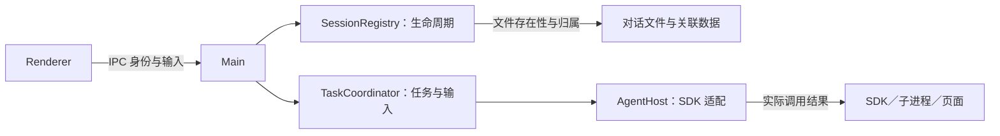

# Desktop 多会话实现说明（删减前历史基线）

> 2026-09-08 起冻结为历史材料。当前迭代唯一技术方案与进度为 [激进删减执行方案](simplification-plan.md)。下文“当前有效”“唯一方案”、实施规则及验收要求均描述删减前基线，不再作为本轮执行约束；本轮信任边界图见新方案第 3 节。

本轮边界概览（规则与进度只维护在上述唯一方案）：

日期：2026-09-07。状态：当前有效方案；新导航、归档与既有执行底座已实现，静态及 CDP 验收通过。系统原生交互按用户要求交付人工表单，未冒充实测通过。

本文是本轮多会话改造唯一技术方案。体验要求见 [spec](spec.md)，实现状态和验收缺口统一见 [acceptance-audit](acceptance-audit.md)。[原架构](architecture-history.md)、[原审计](acceptance-audit-history.md)、[milestones](milestones.md) 和 [最初调查](model-and-session-isolation-spec.md) 仅保存历史证据；其中活动双列表、计数横栏、关闭三选一及直接删除运行会话的旧产品流程不再实施。Kimi 资料只作参考，不构成第二套方案。

## 1. 最终交互

### 1.1 导航

一个左侧栏分成上下两区：上方手动置顶，下方按项目文件夹聚合。保留新建会话入口，底部提供“已归档”入口。右侧仍为对话及既有 Foundry 面板，不增加新的一列。

侧栏顶部为“新会话”“搜索”两整行按钮，图标、文字和留白属于同一点击区域；会话整行同样可点击，⋯ 菜单独立处理、不触发打开。悬停使用统一加深底色，当前会话保持选中底色。覆盖式抽屉不提供 ×，点击外部、右侧 Foundry 面板或按 Escape 收起；宽屏固定侧栏保留。Foundry 原生视图以 before-mouse-event 转发 panel_pointer，使点击独立 WebContentsView 也可收起。

搜索为本地标题／项目匹配，包含已归档记录并明确标注；点击归档结果仍只读。输入框明确范围，不宣称全文搜索。使用现有导航摘要，无新增 IPC、数据库或索引服务。搜索弹层点击外部或 Escape 关闭，方向键选择、Enter 打开；分屏时位于聊天区域。Pi SDK 的 SessionInfo 提供 allMessagesText，终端有内部搜索组件，但未提供独立公开搜索 API，本轮不依赖内部模块或扫描全部正文。

- 置顶后只在置顶区出现；取消置顶回原项目。置顶不更改目录、模式或任务状态。
- 项目以规范化的绝对工作目录为标识，文件夹名用于展示。同名不同路径不合并，必要时展示父目录；历史目录缺失的记录归入“未指定目录”。第一版按路径聚合，不自动合并符号链接别名。
- 置顶按用户置顶顺序排列，新置顶追加；项目及会话以载入时的稳定顺序显示。流片、完成、未读变化只更新原行。新建会话插入所属组顶部，恢复和取消置顶插回所属组，不重排其他行。
- 项目可折叠并持久保存。主动打开某会话时展开所属项目；后台更新不展开。项目内新建沿用该项目目录，模式取当前明确选择；换目录创建新会话。
- 列表合并备团和战斗会话，打开时自动进入会话所属模式。模式不再过滤掉另一模式的导航记录。
- 会话行只有紧凑标题和固定状态位，普通活动只显示小转圈。取消旧活动列表、顶部“运行 N / 待处理 N”横栏及“任务进行中”副标题。
- running、queued、waiting_resource、stopping 使用转圈，悬停或进入对话查看实际阶段；waiting_user 使用静态需回应标记；失败用静态错误标记，未读用小点。状态优先级为需回应、进行中、失败、未读、无标记；对话内保留完整状态。折叠项目可在同一状态位显示子会话聚合标记。
- 窄屏保留普通侧栏展开按钮。普通进展不弹通知；后台完成、失败、需要回应只更新会话标记，不显示顶部横条。系统通知保留去重和不抢焦点策略。

### 1.2 菜单、归档与删除

普通会话右键和悬停“⋯”打开同一个菜单：置顶／取消置顶、重命名、分叉会话、归档会话。无需用户掌握右键才能发现操作。

| 操作 | 行为 |
| --- | --- |
| 置顶／取消置顶 | 更新导航位置，持久保存；不触发模型调用或任务停止 |
| 重命名 | 修改展示标题，空白标题不提交；后续自动摘要不覆盖用户名称 |
| 分叉会话 | 整段复制为同模式独立新会话（Pi 原生 `SessionManager.forkFrom`：新 id、parentSession 谱系、历史与模型随 entries 继承），标题加“分叉：”前缀并继承所选模型，不继承置顶与归档，不复制任务、排队输入与草稿附件；无确认框，完成后打开新会话，源会话零改动 |
| 归档 | 从两区移出，清除置顶，保留历史、目录、模式、模型、草稿附件和阅读位置；展示“已归档 · 撤销”，5 秒后自动消失，鼠标悬停或键盘焦点停留时延后；无关闭按钮和确认框 |
| 查看已归档 | 独立列表按归档时间倒序，可查看历史；不自动恢复、不执行模型请求，输入区提供“恢复会话” |
| 恢复／撤销归档 | 回到原项目，默认不重新置顶；原目录缺失仍保留原归属，执行前沿用目录有效性检查 |
| 永久删除 | 只在已归档页提供；确认“永久删除此会话？对话记录无法恢复，项目文件不会删除。”后执行 |

有未结束任务（含排队、等待用户、等待资源、停止中）的会话不能归档或分叉；菜单禁用并分别说明“任务结束后可归档／可分叉”。后端也必须检查，不能只依赖按钮。归档不暗中停止任务，不引入“完成后自动归档”的隐藏队列。

归档请求的迟到完成不能覆盖用户随后打开归档页或其他会话的选择。归档当前会话后展示原项目的下一可用会话；没有则展示新建入口，不自动提交任务。对后台会话归档不改变当前选择。空归档页显示空态。旧通知指向归档会话时打开只读历史，不自动恢复；指向已删除会话时说明已删除，不打开其他会话冒充目标。

### 1.3 关闭与退出

- × 无论忙闲直接隐藏到托盘，不弹选择框，任务继续。托盘创建失败保留窗口并说明，不能让用户失去恢复入口。
- 点击托盘图标或菜单“打开 ArcaneDesk”恢复原窗口及现场。
- 从托盘“退出 ArcaneDesk”发起退出，不再二次确认。冻结新任务、停止现有任务、等待真实操作退出和持久化后退出。
- 收尾超过一秒显示进度及取消退出入口；取消只解除退出，不撤回已执行的停止。失败保留窗口和原因。
- 操作系统结束进程、崩溃不承诺后台继续；重启恢复历史并标记中断，不自动重放工具。

## 2. 保留的架构与模块边界

主进程拥有执行事实，renderer 拥有选择和阅读状态。会话选择、任务执行、界面同步不能共用一个 busy 标记。继续使用 Electron 主进程和 Pi SDK，不新增服务或消息中间件。

| 模块 | 当前文件／目标变化 |
| --- | --- |
| 会话注册表 | [SessionRegistry](../src/main/conversations/session-registry.js) 按模式持有多个 resident AgentHost；activeHost 只作选择指针。补充跨模式目录摘要及归档准入，不因导航停止其他任务 |
| 任务执行 | [TaskCoordinator](../src/main/tasks/task-coordinator.js) 管理任务、输入、提问、停止和终态；[AgentHost](../src/main/agent-host.js) 保留 SDK adapter，不再另建 PiSessionAdapter 服务 |
| 运行同步 | [SessionProjection](../src/main/sync/session-projection.js) 提供带版本的现场；[session-state](../src/renderer/conversations/session-state.js) 管理缓存、事件和持久工作区 |
| 导航元数据 | [SessionNavigation](../src/main/conversations/session-navigation.js) 提供轻量存储，负责用户标题、置顶、归档；合并两个 registry 的摘要，不复制正文，不拥有任务状态 |
| 导航视图 | [NavigationView](../src/renderer/conversations/navigation-view.js) 从 [chat](../src/renderer/chat.js) 提取分组和菜单投影，复用原导航校准、草稿和阅读恢复；替换旧 ActivityView 的常驻列表与横栏 |
| 活动事实与通知 | [ActivityCenter](../src/main/conversations/activity-center.js) 和 [DesktopNotifications](../src/main/conversations/desktop-notifications.js) 保留未读、摘要、通知去重；前端展示为会话行标记和必要提示，不再另有活动列表 |
| 资源与调度 | [ExecutionScheduler](../src/main/scheduling/execution-scheduler.js) 管额度，ResourceCoordinator（历史文件，已删除） 管资源租约；取消请求不等于实际退出 |
| 生命周期 | ShutdownCoordinator（历史文件，已删除） 及 [main](../src/main/main.js) 负责托盘与退出，复用已有实现 |

这些是职责边界，不要求独立 npm 包。归档与元数据写入接入同会话串行边界；不要另造第二套任务状态机。

## 3. 数据与命令

### 3.1 数据来源与持久化

- 会话稳定 ID、模式、工作目录、模型及历史继续来自原生 SessionManager／现有 registry。工作目录取会话自身元数据，不从当前全局目录猜测。跨项目发现使用 `SessionManager.listAll(modeSessionDir)` 后逐项校验路径和模式标记；SDK 的 `list(cwd, dir)` 会过滤其他目录，不能用于全项目导航。恢复实例以该会话的原始 cwd 初始化。
- 导航元数据按 sessionId 保存：`customTitle?`、`pinnedOrder?`、`archivedAt?`。置顶与归档互斥；旧记录缺字段即未置顶、未归档，现有标题继续可用。
- 主进程原子写入 `config/session-navigation.json`（schemaVersion=1）的导航文件，成功后才回执并发布变更。写失败保留原列表、原元数据，允许重试。
- 草稿附件、阅读锚点、展开内容继续按会话在 IndexedDB 保存；项目折叠也存于 renderer 工作区。归档不清理这些数据。
- 永久删除沿用删除日志和恢复机制，再清理导航、已读和前端缓存；只回收应用拥有且无引用的附件，不删除项目目录或用户源文件。删除失败保留可追踪记录。

### 3.2 接口边界

当前调用以 [preload](../preload.cjs) 与 main handler 为准：`chat:prompt`、`chat:abort`、`sessions:snapshot` 及既有打开／删除路由继续兼容，不为命名统一重写执行链路。

本轮接口已在 preload、类型和 main 同步实现：

| 接口 | 输入与结果 |
| --- | --- |
| sessions:navigation | 返回两个模式统一摘要，含 sessionId、mode、cwd、标题、导航元数据和权威任务摘要；不得隐式创建任务 |
| sessions:setPinned | sessionId、pinned；设置目标值而非 toggle，重复调用安全；归档项拒绝置顶 |
| sessions:rename | sessionId、title；主进程校验标题并持久化 |
| sessions:archive | sessionId；串行确认没有未结束任务、清除置顶并登记 archivedAt；重复归档返回已有结果 |
| sessions:restore | sessionId；清除 archivedAt，不自动置顶或执行 |
| sessions:deleteArchived | sessionId；已归档页使用的删除入口，只接受已归档且无未结束任务的会话，复用删除屏障和删除日志 |
| sessions:fork | sessionId、title?；拒绝已归档（SESSION_ARCHIVED）与忙碌（SESSION_BUSY）会话；驻留会话先落盘再由 Pi forkFrom 整段复制，标题校验同重命名，与源会话所选模型一并登记导航元数据；fork 本身不切换当前选择 |
| sessions:delete（保留旧 IPC 名称） | 继续验证模式和路径，但同样只允许已归档且无未结束任务的会话；不保留旧的直接停止并删除入口 |

主进程通过稳定身份解析所属 registry 和已验证路径，不能接受 renderer 提供的任意删除路径。旧路径 IPC 保持所属模式和路径校验，再补充归档检查。

归档与 submit 并发时：先接收任务则归档返回 SESSION_BUSY；先归档则 submit 返回 SESSION_ARCHIVED，并保留输入草稿。归档状态未知或同步失败时不得乐观允许新执行。恢复、删除、置顶并发同样串行；删除中的会话拒绝其他变更。读取历史与恢复执行分开，查看归档不得借打开逻辑自动新建或提交。

## 4. 不变的执行与同步协议

- sessionId 定位会话，taskId 定位一次任务，commandId 对提交和回答提供幂等；messageId/toolCallId 保持流式与历史身份，attentionId 定位问题。
- 提交回执区分新任务和补充；accepted 仅表示持久接收，消费必须有 SDK 证据。停止中拒绝提交并保留草稿；任务结束与补充的归属由主进程串行决定。
- 主进程 runtimeEpoch + seq 标识现场版本；先监听事件再取得一致快照，丢弃已包含的事件、按序补齐，断档退回快照，旧 epoch 与迟到旧快照不得回退现场。
- selectionToken 只控制当前视图，A 的迟到回执仍更新 A，不污染 B。导航没有 abort、重新 prompt 或释放运行实例步骤。
- 后台完成可直接从快照恢复；半截文本、工具状态和起始时间保持身份。草稿、附件、阅读锚点和展开状态分别恢复，不抢历史滚动位置。
- 停止先显示请求／停止中，等待 SDK 和受控残留操作真实退出；失败或慢停止显示原因。已完成外部成果保留。
- 异常重启标记 interrupted，命令日志可查询，不自动调用模型或重放外部动作。幂等接收不等于外部副作用 exactly-once。
- 停止／中断只展示简洁状态，失败保留真实原因；不渲染“核对进展后继续”按钮和固定指导说明，不自动向输入框添加提示词。普通 abort 回执不作为停止后的红色错误重复展示。
- 输入接收与消费状态继续持久化，但普通发送及处理中间状态不渲染回执节点；发送失败、未消费取消／中断和状态不确定才显示简短提示。发送失败与执行侧未处理分开表达。重试成功清除重试入口，迟到的接收回执不得覆盖消费或终态；快照恢复沿用相同投影。
- 不向正文添加 agent_settled 就绪提示，不常驻输入动作说明；空置顶区隐藏。同步异常仍可见，校准时间放在悬停详情，正文使用用户可理解的进展文案。
- ActivityCenter 的已读位置只在内容实际可见时推进；通知按会话、任务和具体转换去重，历史同步不重新通知。

当前后台正文仍通过 arcane:event 到 renderer，已有有界缓存和流片合并。按会话裁剪正文订阅尚未实现，列为性能优化储备；既有性能门槛仍有效，不将可选架构手段误报为已完成能力或另立必须交付模块。

## 5. 调度与资源边界

当前默认并发 2，上限 16。切换视图不改变额度或队列优先级。waiting_user 释放执行额度，回答后重新申请；取消排队后不得意外启动。

受控 Foundry 页面、世界写入和文件／同工作区 shell 冲突经资源协调。租约只能在操作实际退出后释放，不能在 evaluate 超时或收到取消请求时提前释放。通用 shell 对其他目录的任意副作用及外部应用不在全局隔离保证内。

## 6. 实施顺序与完成条件

| 阶段 | 工作 | 必须验证 |
| --- | --- | --- |
| N1 导航数据 | 跨模式摘要、目录归属、元数据存储、置顶、用户标题、归档／恢复／删除准入 | 旧数据兼容、持久化失败不丢记录、并发归档与提交只有一个生效、已归档无法绕过 IPC 执行 |
| N2 侧栏及菜单 | 置顶／项目两区、折叠、行状态、右键和 ⋯、移除活动横栏与列表 | 同名路径不误并、会话只一份、状态变化不重排、跨模式导航和草稿锚点保留 |
| N3 归档流程 | 归档页、撤销、恢复、确认永久删除、过期通知目标 | 历史查看不执行、恢复回原项目、原成果保留、当前／后台归档不误导航、重启后状态一致 |
| N4 最终验收 | 新侧栏多尺寸／分屏与性能复核、Windows 托盘／通知真实点击 | 新设计完整闭环；mock 或程序触发回调不冒充物理点击证据 |

先保证数据和执行边界，再接 UI，不重写已验收的任务底座。新测试针对数据丢失、竞争和跨会话隔离等实质风险；布局用真实渲染检查，不能只断言 HTML 字符串。

性能门槛保留：选中反馈 P95 ≤100 ms，缓存现场 ≤300 ms，本地同步 ≤1 s，状态呈现 P95 ≤500 ms；在原约定长历史及最大并发基准复核。新界面未测试前，不沿用旧截图声称新界面通过。

当前已完成与剩余工作仅在 [acceptance-audit](acceptance-audit.md) 维护。此技术方案完成不等于产品改造完成。

### Foundry 页面连接

打开页面不展示正在打开、排队、完成等额外状态栏，也不提供取消等待、重置页面、继续等待或收起提示的交互。连接类加载失败自动重试一次；仍失败仅在右侧页面显示“无法连接 Foundry”，不在聊天区域显示；成功导航直接替换错误页。用户通过对话让 Agent 继续处理。重试只加载页面，不重放工具调用或世界写入；证书错误、主动取消和页面销毁不重试。底层页面资源串行准入仍保留。

2026-09-08 交互减负：顶部后台通知条已删除，系统通知与侧栏标记保留。新消息和回到底部合为同一个按钮。缓存切换静默校准，超过 1 秒才显示同步状态。模型／任务错误默认简述，可展开纯文本原始详情；无正文的模型失败保留到分页历史，普通主动停止不生成错误消息。验收见 [本轮记录](interaction-priority-review.md)。

消息回执修订：普通发送、已接收、排队、分发、进入上下文、已消费均不显示消息下方小字，无延迟显示或等待时长阈值。仅发送失败、未处理的终止或接收结果不确定等异常保留反馈；内部状态照常持久化，不投射为用户需要理解的阶段。
