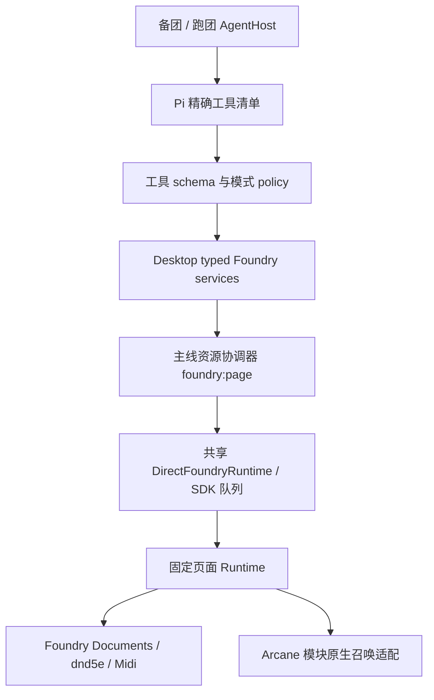

# Foundry 备团与跑团工具：唯一技术方案

更新日期：2026-09-08。状态：首轮 App/SDK 已实施并完成所列验收；工具体验进入 benchmark 驱动迭代。
召唤等包侧依赖仍未完成，不能宣称全部目标已交付。当前迭代进度与证据见第 14 节。

本文完整定义本轮要做的产品行为、工具合同、实现架构、兼容迁移和验收要求。
本文是本轮工作的唯一实施依据，不依赖此前 spec、架构讨论或风险评估稿。
本文同时承接后续每轮迭代的范围、技术决策、进度、验收结论与剩余问题。
专项报告保存详细证据，不能另立一套当前计划或完成状态；更新规则见第 14.1 节。
既有安装/运维、安全和会话架构文档继续适用于各自领域，不另行定义本文工具行为。

延期事项：[短休/长休 TODO](./foundry-rest-todo.md)。两种模式本轮均不实现休息接口、
内部休息服务或通过 execute_action 使用的休息动作；该 TODO 不属于本轮交付承诺。

### auto pack 协作纪律

auto pack 正在独立重构。本轮只允许只读查看其实现，不实际修改 auto pack 的源码、
编译器、生成物、版本或发布配置，也不安装/发布修改版、不迁移其世界数据。
发现任何需要 auto pack 配合的变更，先记录到 [auto pack TODO](./todo.md)：
写清背景、需求、改造思路、App/SDK 依赖与未满足时的行为、后续验收条件。
同一事项持续更新，不把待讨论 API 当作已经存在或已获包侧确认的合同。

本纪律也适用于第 8 节的取消召唤同先攻，以及后续休息、专注或完成回执中发现的包侧依赖。
第 8 节保留目标与协议草案，不能据此授权修改 auto pack；包侧工作交由其重构工作统筹，
只有用户后续明确恢复包侧实施后才可修改。休息相关细节继续由休息 TODO 记录并互相链接。
App/SDK 可推进不依赖包改动的部分和兼容检查；依赖缺失时在首次写入/扣费前明确拒绝，
不复制包内规则、注入补丁、绕过检查或用旧同先攻协议冒充新召唤能力。
这些待办不阻塞无关能力交付，但依赖未满足的功能必须标记未完成，不能宣称整份方案已交付。

## 1. 目标与边界

把高频 Foundry 操作封装成固定工具，减少模型临时写 JavaScript、选择 API、搬运 ID、
管理技术参数和重复回读的成本。DM 负责裁定，agent 负责落实。

| 模式 | 产品名称 | 负责什么 |
| --- | --- | --- |
| prep | 备团 / Prep | 内容制作、角色与场景编辑、资料整理、安装运维 |
| combat | 跑团 / Play | 探索、扮演、休整和战斗中的法术、攻击、状态、资源操作 |

保留内部 `combat` key、历史目录和会话模式标记，只修改产品显示名称。
是否正在战斗由 Foundry 世界状态决定，不新增探索/战斗开关，不自动切换聊天模式。
保留主线已有的会话模型隔离、多会话驻留、任务调度、通知、资源等待和取消行为。

最终行为：

- 备团的常见角色/场景任务无需生成页面 JS。
- 跑团的明确状态指令通常一次工具调用完成。
- 没开战也能查角色能力、施法和执行明确的攻击。
- 角色关注范围：有战斗取本场参战 Token，无战斗取当前 Scene 全部 Token。
- 关注范围一次返回完整静态信息与能力，后续只读轻量动态状态；不逐角色查询能力。
- 执行者必须是关注范围内的 Token；叙事施法正确记账，可用动画则展示，无动画也完成。
- 门、锁、地点等无需全部实体化；法术的叙事结果由 DM 决定。
- 召唤保留原生放置，取消自建同先攻绑定；DM 用普通战斗跟踪器参战、独立掷先攻。
- 专注何时结束由 DM 下指令，不新增自主到期、回合 tick 或跨战斗清理系统。

不做：完整无 Token Activity/Midi 自动化、通用门锁/物品目标模型、职业动作新实现、
反应/插入 workflow、仪式与长时间施法协议、世界时间管理、战术裁判、自动开战、
所有 Document 的 CRUD、任意脚本 passthrough。Walls/Lights 等场景写入留待后续。
已有职业相关能力不在本轮重构范围，不把它们当新功能承诺，也不顺手删除旧行为。

## 2. 最终工具清单与数量

### 2.1 模式矩阵

| 工具 | effect | 备团 | 跑团 | 变化/用途 |
| --- | --- | --- | --- | --- |
| foundry_open | interface | ✓ | ✓ | 保留连接与登录停机点 |
| foundry_screenshot | read | ✓ | — | 保留视觉诊断 |
| browser_evaluate | unknown/write-capable | ✓ | — | 仅备团保留高级路径 |
| world_status | read | ✓ | ✓ | 开放给备团；固定诊断替代跑团 JS |
| foundry_play_context | read | ✓ | ✓ | 替换 combat_turn_context，无战斗也能读现场 |
| foundry_conditions_set | write | ✓ | ✓ | 新增状态设置/移除与结束专注 |
| foundry_content_search | read | ✓ | — | 新增世界/合集内容搜索 |
| foundry_actor_get | read | ✓ | — | 新增角色编辑前读取 |
| foundry_actor_create | write | ✓ | — | 新增空白/合集角色创建 |
| foundry_actor_update | write | ✓ | — | 新增有限字段与图片/Token 更新 |
| foundry_actor_grant_items | write | ✓ | — | 新增从合集授物 |
| foundry_scene_get | read | ✓ | — | 新增明确场景读取 |
| foundry_scene_apply | write | ✓ | — | 新增场景元数据、背景、批量 Token |
| foundry_static_context | read | — | ✓ | 保留 combat_battle_context 的一次重上下文协议，扩展无战斗场景范围 |
| foundry_execute_action | write | — | ✓ | 替换 combat_execute_turn，兼容战斗与叙事使用 |

备团保留原三个 Foundry 工具，增加七项核心能力（search、actor get/create/update/grant、
scene get/apply）和三个共享入口（world_status、play_context、conditions_set），
共十三个 Foundry 工具。另保留平台 read/edit/write/powershell 或 bash。

跑团固定六个 Foundry 工具：open、world_status、play_context、static_context、
execute_action、conditions_set。相对原六工具：移除 browser_evaluate，
替换三个战斗名称，新增状态，数量不变。不同时注册旧名称作为模型可见别名。

主线已存在的 `request_user_input` 是通用会话工具，两个模式均保留，不计入六个
Foundry 领域工具；因此主线合并后的实际跑团 active set 是七个，备团是十八个。
测试必须核对真实总集合，不能以“领域六个”掩盖额外注册。

### 2.2 唯一工具可见性来源

所有自定义定义通过 Pi `customTools` 注册；`TOOL_NAMES_BY_MODE` 精确清单传入
Pi `tools`，同时控制 builtin/custom。取消 combat null=所有 custom 的扩大语义。
`buildTools()` 不按模式过滤核心定义；模式差异只在 allowlist、prompt 和 policy。
shell 继续由同名 custom override 提供应用管理的 Node 环境。

会话 attach 后校验 `session.getActiveToolNames()` 与清单集合完全相同，未知名称、
漏注册、多注册均失败。分阶段开发只加入已经实现的工具，不预注册占位名称。
`excludeTools` 仅用于紧急禁用，不替代模式清单。不为普通开战/结束战斗动态装卸工具。

## 3. 架构与职责



| 层 | 负责 | 不负责 |
| --- | --- | --- |
| 模型工具 | 领域输入、短说明、结果呈现 | 拼 JS、通用 SDK action 名、Base64、技术请求身份 |
| mode policy | 工具可见性、审批偏好、回合执行限制 | 复制一套 prep/play 业务实现 |
| Desktop services | 精确引用、内部请求身份、本地资源读取、结果映射与编排 | 自己执行 Foundry 文档方法 |
| 资源协调器 | 页面/工作目录资源互斥、等待提示、取消、实际操作生命周期 | 世界外所有 GM 操作的全局锁 |
| SDK | typed action、preflight、允许 action、串行队列、dispatch 与中断语义 | 模型工具选择和 UI 模式 |
| 固定 Runtime | 执行时重新检查对象/资源、受限读写、实际回读 | 模型提供的代码、叙事裁定 |
| 自动化模块 | 现有法术/攻击 hooks 与召唤原生集成 | 强制施法者与召唤物同先攻的新协议 |

每 App 仍共享一个 Runtime client。复用主线 `withResources`、`foundry:page`、
`callForSession` 与 AsyncLocalStorage 的归属传递，不能恢复为每模式新建 client。
资源锁在最外层取一次，组合服务调用无锁内部 SDK 方法，禁止嵌套获取同一页面锁。
图片操作同时需要工作目录资源时一次申请所需资源集合，避免先锁文件再等页面的死锁。

SDK 单 action 串行不等于多个 action 的事务。状态/记账采用单次固定组合 action；
图片、角色创建等多阶段操作由服务持有外层资源租约，记录每步结果并重新核查必要身份。
取消/超时后底层未停止时，沿用主线实际操作保留资源机制，不因模型收到响应就解锁。
本轮不增加优先级队列、后台时间管理器或另一套恢复锁。

## 4. 公共模型合同

### 4.1 精确身份与有限输入

新 schema 全部 `additionalProperties: false`，采用可判别 union，拒绝不属于分支的字段。
ID/UUID/ref 最多 256 字符，名称 256，搜索 query 256；枚举固定，数值必须有限。
写目标最终是精确 UUID/ID；模糊匹配只用于搜索结果，不直接决定写入。

```ts
type Source =
  | { kind: "actor"; actorUuid: string }
  | { kind: "token"; tokenUuid: string }
  | { kind: "selected" }
  | { kind: "name"; name: string; scope: "focus" | "actors" };

type DataImage =
  | { kind: "local"; sourcePath: string }
  | { kind: "foundry"; dataPath: string };

interface ActorImageInput {
  image: DataImage;
  syncPlacedTokens?: boolean; // default false
}

interface CompendiumGrant {
  packId: string;
  entryId: string;
  expectedName?: string;
  expectedType?: string;
  quantity?: number; // integer 1..999
  equipped?: boolean;
}
```

Source.name 只允许完整名称或已有配置别名的唯一匹配，scope 固定搜索边界；重名返回
至多五个候选，首次写前停止。focus 是本场参战 Token 或无战斗时当前 Scene 全部 Token。
跑团只接受 focus 内的 token/selected/name，不接受独立世界 Actor 引用或 actors scope；
不从世界 Actor、配置队伍或其它 Scene 补充角色。不建设 roster 配置与队伍发现功能。
actor/actors 仅供备团编辑和备团的共享状态操作，仍可处理未放图的世界角色。

selected 绑定消息提交时的受控 Token 快照，不混用 targeted tokens；用于单一施法者
时必须唯一，批量状态则允许展开。引用场景 Token 时保留其实际 synthetic Actor；
不能把 unlinked Token 的消耗或状态写到同源世界 Actor。

### 4.2 技术参数不交给模型

Desktop 注入 `requestId`、会话/任务/toolCall 身份、绑定 world、必要 scene 和当前回合
证据；模型 schema 不暴露这些字段。读取的 UUID 与动作引用可直接用于下一步。
消息所属会话、世界、选中目标不随当前可见聊天或用户后来点选改变。
world 绑定包含 Foundry origin 与 worldId，避免不同服务器的同名/同 ID 世界相互混淆。
在用户消息入队时固定代码读取轻量 page/world/selection 身份，写入该输入的宿主元数据，
不将整场景注入 prompt；当时未连接则记录空身份，不能执行时猜测 selected 指向。

只有备团“基于刚读到的内容进行编辑”使用 `readRef`。readRef 是会话内不透明句柄，
保存目标与读取投影；Runtime 在写前核对本次涉及字段/嵌入对象的摘要。无关 HP 变化
不使图片编辑失效；普通状态/扣费/攻击不要求 readRef 或全 Actor revision。
引用失效或涉及未读取字段时重新读取相应投影，不让模型拼 fingerprint。

### 4.3 统一写结果

```ts
type StepReceipt = {
  step: string;
  targets: string[];                 // exact UUIDs
  state: "completed" | "not_started" | "unknown";
  summary: string;
};

type WriteResult =
  | { status: "completed"; operationRef: string;
      steps: StepReceipt[]; verification: Verification; warnings: string[] }
  | { status: "rejected"; operationRef: string;
      code: string; message: string; candidates?: Candidate[] }
  | { status: "partial"; operationRef: string; retry: false;
      steps: StepReceipt[]; message: string }
  | { status: "indeterminate"; operationRef: string; retry: false;
      steps: StepReceipt[]; message: string };
```

Verification 为每个 typed action 的明确结果投影：编辑字段 before/after、创建 UUID、
状态 before/after、资源变化、召唤成员等；不是任意完整文档。Candidate 只含精确引用、
name、type 与必要区分信息。旧 executeTurn v2 外层保持兼容，Desktop 映射为该结果。

rejected 保证没有世界/资源副作用；partial 是已确认部分完成；indeterminate 是派发后
不能确认结果。后两者禁止自动重放，即使参数看似幂等。completed 已含所需核验，
除保留的战斗后 turn 回读外，不要求模型再读一次来重复验证。

### 4.4 轻量操作记录

复用会话/任务持久化边界，新增本地 operation 记录，主键为 session/task/toolCall，
存储 requestId、world、参数摘要、dispatch 标记、步骤和结果，不存图片二进制。
文件位于 `userData/foundry-operations/<sessionId>.jsonl`，串行追加；创建目录/落盘失败时
在 dispatch 前拒绝写入。按会话删除流程一并清理，不与用户项目内容混放。
派发前先落记录；同 toolCall 重复投递返回原结果或原不确定状态，不再次写入。
不同的新命令不按参数去重。重启时有 dispatch 无终态的记录标为不确定，禁止自动续写。
创建文档额外在 flags.arcanedesk 保存 requestId，用于按精确身份回查重复创建。
不建通用 world ledger 或分布式事务。掉线时仅有扣费余额不足以证明是哪次请求造成，
不能凭余额猜成功后恢复发送。readRef/actionRef 重启后失效，操作记录仍可查询。

## 5. 备团内容工具合同与执行

以下参数除注明可选外必填；UUID 必须属于绑定 world 或允许的 Compendium。

### 5.1 foundry_content_search

输入：`scope: world|compendium`、`documentType: Actor|Item|Scene`、`query`；可选
`packIds`（最多 20）、`actorType`、`itemType`、`limit`（默认 20，最大 100）、`cursor`。
首版组合仅 world Actor/Scene、compendium Actor/Item；其它组合返回 INPUT_INVALID。
输出精确 UUID/id/name/type；合集另含 packId/entryId/package。有限分页，不扫全文后
把全部文档送给模型。来源模组、角色类型等足够消歧即可。

### 5.2 foundry_actor_get

本节为当前合同；R1 将改善编辑投影的易用性，尚未修改参数，见第 14.3 节。

输入 `actorUuid`；可选 `include: [items,resources,prototypeToken,sceneTokens]`、
`limit`（默认 30，最大 100）及对应分页 cursor。默认 summary：name/type/folder/img
和关键 HP/AC。输出 readRef；完整 Item/system 原文不作为默认结果。
sceneTokens 读取该世界各 Scene 中真正指向目标 Actor 的 Token，区分 linked/unlinked。

### 5.3 foundry_actor_create

本节为当前合同；R1 计划补齐创建时的原型设置，尚未实现，见第 14.3 节。

输入 `source: {kind:blank,actorType:character|npc} | {kind:compendium,packId,entryId}`、
`name`；可选 `folderId`、`image: ActorImageInput`、`initialItems: CompendiumGrant[]`。
initialItems 最多 50。folder 必须是已有 Actor folder；不按名称自动创建目录。

流程：解析合集与资源 → 检查同名/同 request → 建 Actor → 设置图片 → 授初始物品
→ 最小回读。全部可预检项在首次写前检查。同名返回已有候选，不随意再建；DM 可改名
后再次请求。同一来源创建不同名字允许。Actor 已建而后续失败返回 partial 和 UUID，
不删除已建角色、不重新创建。初始图片同已有角色图片规则。

### 5.4 foundry_actor_update

输入 `actorUuid`、`readRef`、非空 `changes`。白名单：

```ts
interface ActorChanges {
  name?: string;
  folderId?: string | null;
  image?: ActorImageInput;
  prototypeToken?: {
    name?: string;
    width?: number; height?: number; // >0, <=100
    disposition?: -1 | 0 | 1;
  };
  dnd5e?: {
    hp?: { value?: number; max?: number; temp?: number };
    ac?: { flat?: number };
  };
}
```

不暴露任意 dotted patch。HP 非负且 value 不超过修改后的 max；临时 HP 非负；flat AC
仅适用于当前配置支持的模式，不能只写 flat 后声称派生 AC 已改变。超出支持范围拒绝，
具体数值由 Runtime 检查实际 system 字段，不自动裁定“合理属性”。
image 更新 actor.img、prototypeToken.texture.src；Token Ring 已启用时同步 subject
texture，不擅自启用 ring。syncPlacedTokens=true 时只更新绑定 Actor 的存量 Token
图片/ring，不能覆盖其独立名称、尺寸、位置。范围在回执列出，逐文档报告部分完成。

### 5.5 foundry_actor_grant_items

输入 `actorUuid`、`readRef`、`items: CompendiumGrant[]`（1..50）。
只从精确 pack/entry 获取，不接受完整 Item 文档。校验数量、类型、expectedName/Type。
复用来源追踪和批量 createEmbeddedDocuments；同来源已存在时返回 skippedExisting，
不默认叠加数量，不自动替换已有物品。读取 projection 必须包含相关嵌入 Item 身份；
真正需要调整既有数量或重复授予时明确说明首版范围，不能偷偷重复创建。

### 5.6 foundry_scene_get

输入 `sceneUuid`；可选 `include: [tokens,walls,lights,tiles,notes,sounds]`、limit/cursor。
默认元数据、背景、尺寸、网格、active 与 readRef。显式读取目标 Scene，不依赖当前
canvas。placeables 分类型分页，默认 50、最大 100，不把整张大场景返回。
读类型可以宽于首版写类型。

### 5.7 foundry_scene_apply

create 分支输入 `operation:create` 和 scene；update 分支另要求 sceneUuid/readRef。
scene 白名单：name、active、background:DataImage、width、height、grid。
grid 为 type/size/distance/units；尺寸、网格类型和范围使用实际 Foundry 支持值验证。
create 必须有 name，缺省尺寸/网格使用系统默认；update 未提供字段保持原值。

```ts
interface TokenPlacement {
  actorUuid: string;
  x: number; y: number; // scene pixel coordinates
  name?: string;
  hidden?: boolean;
  disposition?: -1 | 0 | 1;
  width?: number; height?: number;
  elevation?: number;
  actorLink?: boolean;
}
interface TokenPlacementUpdate {
  tokenId: string;
  changes: { x?: number; y?: number; name?: string; hidden?: boolean;
    disposition?: -1 | 0 | 1; width?: number; height?: number; elevation?: number };
}
interface TokenLayout {
  create?: TokenPlacement[];
  update?: TokenPlacementUpdate[];
  deleteIds?: string[];
}
```

tokens 为可选 TokenLayout；合计至多 100 个操作，ID 不可重复或同时 update/delete。
actorLink 缺省继承 actor prototypeToken，不强制设 false。坐标/尺寸有限且通过系统验证。
流程：预检/准备背景 → 创建或更新 scene → 按 create/update/delete 分组批量写 Token
→ 必要回读 → 若 active=true，最后激活。顺序固定、逐组记结果，不循环单 Token API。
删除是 destructive 操作，审批摘要明确数量；第一版不删除 Actor/Scene。
create Scene 与 Token 都记录请求来源，导航不确定时可查已创建对象，不盲目重建。
不写 walls/lights/tiles/notes/sounds；后续在同一工具加可选段，不增加 CRUD 工具矩阵。

### 5.8 图片与本地资源

本地 sourcePath 最大 4096 字符；Desktop realpath 校验在用户 prep cwd 内，拒绝目录
穿越、符号链接越界。首版 png/jpeg/webp，单文件至多 10 MiB；校验真实格式与大小。
模型不读取/传 Base64。SDK 内部有界上传到 Data 的 `arcanedesk/assets/<hash>.<ext>`，
默认不覆盖不同内容；成功后保存稳定 Data 相对路径，不写系统绝对路径。
dataPath 同样只接受有效 Data 相对路径，拒绝外部 URL、绝对路径与 `..`。
无法上传/文件不在围栏时返回原因，不用 shell 越界搬运。工具输出不包含二进制内容。

## 6. 共享世界、现场与状态

### 6.1 world_status

保持无参数。输出 world ID/title、system/version、Foundry version、GM/ready、
必要模块与 capability 摘要。未就绪等待采用既有上限；失败由固定代码返回 URL/page
ready/runtime 状态，不让跑团模型写诊断 JS。
foundry_open 遇到 /join 保持登录停机点，由用户登录，禁止自动提交凭据或轮询登录。

### 6.2 foundry_play_context

输入 `{view:current}`（默认）、`{view:turn}` 或 `{view:operation,operationRef}`。
current 自动读取同一关注范围的动态状态：有效战斗取参战 Token，无战斗取当前 Scene
所有 Token。turn 保留战斗回合的读取语义，无有效回合时返回 turn:null 和场景动态状态。
返回范围标识、Token 身份、HP/资源/状态、当前行动者与 availableActionIds 等轻量信息；
不返回完整能力定义、input schema、描述或静态角色卡，不引入逐角色读取分支。
轻量指每个对象只读必要动态字段，不是截断 Token 数量；静态/动态关注名单必须一致。
operation 只查本会话已知操作记录和已确认结果，不执行恢复写，不枚举别的会话记录。

静态上下文与动态上下文的动作标识由服务维持稳定映射，不每次读取重新生成引用。
模型从一次完整静态上下文获得定义，后续通过轻量可用 ID 判断当前可执行动作；
不能为了查 ID 再逐角色获取能力。状态/记账不强制读动态上下文，战斗动作保留最新 turn 前置读。

### 6.3 foundry_conditions_set

输入 `targets: Source[]`（1..20）、`conditions: [{key,active:boolean}]`（1..8）。
selected 作为批量选择时必须是唯一 selector，展开后仍最多 20；相同实际 Actor 去重。
重复矛盾的 key/active 拒绝。key 由受支持 system ID/版本化中英文别名精确解析，
不靠名称猜自定义效果，也不把全部 CONFIG.statusEffects 放进 prompt。

只提供明确有/无，不提供 toggle，不混入 HP patch。执行内部解析目标、预检、读取
当前状态、设置、回读。已满足条件为 noop，不重复创建。linked Token 共享 Actor
影响在回执说明；unlinked 只写实际 synthetic Actor。

普通状态使用验证过的系统入口。去状态不能删除承载其它属性/状态的整个效果；
复杂来源返回 SOURCE_MANAGED 和来源说明，不假称解除。仅纯手动标记可直接去除。
专注是明确支持的特殊分支：active=false 对系统专注调用正式结束入口；对手动标记
直接去标记。系统已关联的清理属于此次命令结果；无关联资料不猜着删模板/召唤物。
active=true 仅手动标记，不模拟施法、不创建资源/法术依赖关系。
输出实际对象与 key 的 before/after/noop、剩余来源和 warnings；不返回完整 effects。

不新增专注检定、倒计时、回合/战斗结束监听；新手动标记等待 DM 移除。
既有 system/Midi 已有自动化不被本轮静默禁用，agent 也不把实际已变状态自动恢复。

## 7. 角色动作发现与执行

### 7.1 foundry_static_context

输入保持无参数，不增加 scope/source/query/limit/cursor 分支。它是静态上下文工具，
不是能力搜索工具；foundry_static_context 的名称替换不改变原 battle_context 的核心职责。

Runtime 自动确定关注范围：

- 有有效战斗：使用本场 combatants 的 Token，完整保留原 battleContextDataV2 的
  参战者、阵营、static blocks、完整 action 目录和 input 合同，一场战斗开始时读一次。
- 无有效战斗：枚举当前 Scene 文档的全部 Token，同一次调用返回全部角色静态信息与
  完整能力目录。包含隐藏/未选中的 Token，不按玩家队伍、友敌或是否当前可见筛选。
  无 Actor 的 Token 仍返回身份和空能力说明；不去世界里找替代 Actor。

输出范围标识（world、scene、可选 combat）、完整 Token 名单，以及各 Token 的静态
角色数据和全部受支持动作定义（稳定 actionRef、名称/type、input 合同、执行路径）。
完整重上下文直接进入模型对话上下文，不能仅在宿主缓存后让模型反复按角色取片段。
非战斗首次读取较慢可以接受，不用分页、Top-N 或逐角色查询换取首次响应速度。
如果超过实际传输/上下文硬上限，明确报告，不能静默截断后称为“全部”。

之后只调用 foundry_play_context 获取动态状态，不重复传静态描述与参数合同。
切换 Scene、开始新战斗或结束战斗导致范围改变时，下一次需要能力前重新读一次重上下文。
同一范围内新增/删除 Token、相关 Item/Activity 被替换等确实使快照失效时，轻量读取
或执行返回明确失效信号，按需重建一次；普通 HP/资源/状态、回合变化不触发重读。
已存在历史的会话恢复时，如宿主引用失效则重建一次，不重放旧写调用。

actionRef 必须绑定 world、scene、source Token、实际 Actor、Item、可选 Activity 和
合同版本；执行时确认 Token 仍在当前关注范围，再检查最新资源，不接受世界 Actor 旁路。
对有 Token 且可明确计算普通消耗的 Spell Item，可返回仅 narrative 引用，不强行
要求 utility Activity。反应/职业动作不作为本轮新增可执行项，限制随静态目录说明。

### 7.2 foundry_execute_action 模型输入

```ts
type ExecuteInput =
  | { actionRef: string; targetTokenUuids?: string[];
      input?: ActivityInput; resolution?: "auto" | "narrative"; advance?: boolean }
  | { actions: Array<{actionRef:string;targetTokenUuids?:string[];input?:ActivityInput}>;
      advance?: boolean };
```

批量 1..20，仅现有战斗同一行动者序列，拒绝同时传单次和批量字段；非战斗一次一个。
召唤必须单次。resolution 默认 auto，批量不支持 narrative。advance 默认 false，
无有效战斗时 true 拒绝；DM 明确要求结束回合时才能传。首版不增加纯 advance-only
分支，保留现有执行后推进语义，原生界面仍可单独推进。

ActivityInput 沿用稳定已支持合同：spellLevel、attackRollMode、selections、allocation、
declaredRiders、targetSpec。字段只在该动作 input 合同允许时生效；新 wrapper 不接受
任意 extras。selections key/value 由目录列出的有限集合验证；allocation 是精确目标
与数量，declaredRiders 只兼容已有声明。目标模式仍 self/selected-targets/placed-template，
不为门锁补新实体模式。既有兼容字段在旧 SDK v2 保持行为，不扩大新工具输入范围。

source 来自 actionRef，execute 不允许另传 source 替换角色。
工具描述只讲用户意图；技术 requestId、world、turn、资源池选择由服务/Runtime 处理。

### 7.3 决定路径后再写

1. 解析引用，检查 world/source/Item、实际战斗关联与必要资源。
2. 选择既有自动化或叙事记账，构造固定执行计划。
3. 执行前完成可检查的输入、余额、目标与能力校验。
4. 执行并按路径核验，写操作记录，返回准确结果。

auto 优先既有受支持系统/Midi 流程。施法者必须有关注范围内 Token；写前已知无实体目标且属于可记账的
普通叙事法术时进入 narrative；不能把缺失伤害目标、反应、未知消耗或无效配置都
当成可静默兜底。攻击/真正放置召唤不无提示降为“记账成功”。
DM 明确只记录施法可用 narrative，即使该法术也能自动化；此路径明确不结算伤害/放置。
调用原生流程后即使失败/超时，也不能改路径再扣一次。不存在“先试，再补扣”策略。

### 7.4 自动化路径

从 executeTurnV2Data 提取共同的动作定位、参数/资源检查、performUseAction 和回执
核心；Turn policy 只负责当前行动者与推进。非战斗使用明确 source，仍复用现有
攻击/法术流程与实际 Token，不建设完整无 Token Activity 执行。

普通攻击继续由系统/Midi 完成命中、弹药、伤害等，不自行计算 HP 或推断优势。
无 combat 的明确攻击不自动开战；“开战并攻击”顺序未明确时交 DM/宏处理。
正在有效回合内只允许当前行动者主动执行，不能用 narrative 绕过回合限制。

现有 execute 完成后仍由 play_context(view=turn) 获取战斗实际变化，不把旧原生
执行响应误当完整伤害状态。新 wrapper 先保留这个已知协议；合并后置回读是独立
性能优化，不在本轮混入行为变更。

### 7.5 叙事记账路径

用于 DM 主导的易容术/敲击术等：要求关注范围内施法者 Token、真实拥有的 Spell Item 和可识别消耗。
复用已有资源池解析；普通 spell slots 与明确升环、已支持池按实际配置扣除；
确认无消耗则不扣。拒绝不明确/不足资源，不自动升环、换池或增加上限。
只需小范围 Actor 消耗服务，不需要完整 actor-only Activity adapter。

单次固定 Runtime 内：读余额 → 一次受限 Actor 更新/受支持纯消耗入口 → 回读。
用纯消耗入口时必须证明不会重复施法/hook 消耗；不能调用完整 Item use 后再手扣。
已绑定 Token 且独立视觉入口可用时播放动画，不触发第二次 Item use；无动画时跳过视觉。
若需包侧补独立入口，按 [AUTO-003](./todo.md#auto-003-叙事施法的独立视觉入口可选) 交接，当前不修改包。
Token 消失/离开关注范围时在扣费前拒绝，不降成无 Token 记账；扣费后消失则报告已扣费与未播放。
动画失败为 warning，记账仍 completed。回执区分“已记施法与消耗”和“已自动结算”。
不宣称门已解锁、画像已变或 NPC 已受骗；不创建对应实体。

仪式/长施法时间由 DM 线下处理，本工具不计时/推进时间。明确提出暂不支持用法时
说明限制，不能把仪式偷偷按普通扣位处理。纯叙事施法不自行创建专注生命周期；
DM 需要状态标记时使用 conditions_set。

## 8. 召唤改造：去掉同先攻依赖

本轮采用原生召唤放置后，DM 用普通战斗跟踪器加入战斗并独立投先攻。
没有 Combat 或先攻不再是召唤失败；不自动创建 Combatant，不提供同先攻开关，
不开发“探索召唤后开战时重新绑定施法者先攻”的状态机。

原生 dnd5e Summon 提供选择和场景放置；Foundry 核心战斗跟踪器提供投先攻。
这是减少自定义维护的流程选择，不是对所有召唤法术规则的断言。
参考：[dnd5e Summon](https://github.com/foundryvtt/dnd5e/wiki/Activity-Type-Summon)、
[Foundry Combat](https://foundryvtt.com/article/combat/)。

### 8.1 模块侧待办（本轮只记录，不实施）

以下为交给 auto pack 重构工作的需求与改造草案，追踪于 [AUTO-001](./todo.md#auto-001-召唤解除同先攻与战斗依赖)。
具体函数位置和接口以重构后的实际实现重新核对，本轮不修改该包。

公开模块 `packages/auto2014-runtime/src/automation.js`：

- prepareNativeSummonUse 保留 GM、实际 source Token、场景、profile、请求身份、
  数量和权限检查，移除 source Combatant/有限 initiative 的必需条件。
- finalizeNativeSummonCore 以确切放置 Token、所有权、来源、资源及已有原生完成
  信号收尾，不再调用 nativeSummonEnsureCombatants、复制 inheritedInitiative、
  保存/恢复同先攻特殊游标或要求 active Combat。
- 不新增生命周期监听器。已存在且正常工作的来源/系统依赖保留；移除只为同先攻
  建立的条件。遗留召唤物已有 Combatant 不自动删除/重掷，新召唤走新规则。
- 编译器/emitter 和输出 marker 同步新协议；Actor 上复制的旧 Item 不能假设自动更新。

### 8.2 协议版本化草案（待包侧确认）

建议模块新增 capability `nativeSummonPlacementV2`，采用新 API
`finalizeNativeSummonPlacement`，不在旧 finalizeNativeSummonUse 下悄悄改变回执。
新 marker 明确 `combatBinding: "manual"`，新 schema 显式识别，不向旧严格 marker
随意塞额外字段；编译器和 SDK parser 同时更新。

新 placement 回执包含 schema、requestId、sourceActorUuid/sourceTokenUuid、
activityUuid/profileId、expected/placed/skippedCount、members[{tokenUuid}]、
消息/workflow 引用（如有）、已确认资源/来源和 warnings；不要求 Combatant/initiative。
DM 跳过全部放置时资源可能已消耗，报告“已施法，放置跳过”，不假称已有实体；
用户要求放置但只放部分时返回 partial，禁止自动重施。

旧 API/SDK executeTurn v2 继续服务旧调用方，旧战斗行为不被新结构字段破坏；
新 executeAction 只有新 capability+匹配 marker 才调用新放置协议。旧版本组合
在首次写前返回 CAPABILITY_UNAVAILABLE，明确需要更新模块/角色数据，不能先扣费。
发布验收必须测试旧/新模块、旧/新 Actor Item 的矩阵；不批量迁移玩家世界数据。

## 9. 最小环境校验与恢复

只检查与本次命令相关的身份和条件；不要求世界整体快照不变。

| 变化 | 行为 |
| --- | --- |
| 发消息时选 A，执行前选 B | selected 使用提交快照中的 A；回执写实际名称 |
| “当前人攻击”读到 A 后已转 B | 校验捕获的 combat/currentCombatant/round/turn，零写拒绝 |
| 无关角色 HP/状态变化 | 不阻止本次状态/记账，不重载整个目录 |
| 资源已被 DM 用掉 | 读取当前余额，不用模型记忆；不足拒绝 |
| 换世界 | 绑定 world 不匹配拒绝，不按名字找新世界替身 |
| 刷新后仍同世界 | 写前重新定位精确对象；已派发的不确定请求不重放 |
| 切场景 | 重建新范围的静态上下文；旧来源不在关注范围则零写拒绝，叙事记账也不能绕过 |
| 来源 Token 删除/离开关注范围 | 不再发现或执行，不回退世界 Actor 扣费 |
| 排队时开战 | 检查 source 的实际关联回合；非当前人拒绝，未开始 tracker 不等于战斗 |
| 只切 App 会话 | 请求仍属于原会话/任务/对象，不能随当前可见会话漂移 |

不只看全局 game.combat 是否非空：对相关 Scene/实际 Actor 检查真正进行中的战斗。
关联不唯一时说明，不默选；其它场景独立战斗不应阻止无关联角色的叙事记账。
所有检查在排队结束、实际 dispatch 前执行，审批等待后再验一次必要条件。
外部 GM 不受本地锁保护；遇到实际并发冲突回读并报告，不循环把世界改回旧状态。

派发前取消是零写；派发后中止/超时/导航沿用四态。动画与可选展示失败不等于扣费失败。
恢复仅能查看原 operation 与实际对象；不能自动重放 partial/indeterminate，也不能
用 browser_evaluate 做同一次失败写的替代通道。

## 10. Prompt、审批、回执与性能

跑团 prompt 按意图短路：状态直接 set。休息由 DM 在 Foundry 原生界面操作，不在静态
上下文注入休息动作，也不通过 execute_action 或属性 patch 模拟休息。使用能力前若当前范围尚无有效
静态快照，调用 static_context 一次获取全部重上下文；不按指令逐角色查询能力。
非战斗后续从已有目录选动作直接 execute；战斗后续每次最新 turn、execute、战斗后
turn 回读，不重复静态目录。旧“每条指令必读
turn”的描述必须同步缩小，不让工具说明重新阻塞状态/叙事快速路径。
成功回执一行；复杂 partial/indeterminate 只说明已确认结果与需要 DM 处理的部分。

备团 prompt 和 actor skill 更新结构化优先；未覆盖的 Journal/高级内容仍可用受控
browser_evaluate，但不能在结构化写不确定后换 JS 重试。安装/迁移等已有 skill 流程不变。
跑团不注册 JS/shell/文件工具，诊断走 world_status 固定实现。

read 无写审批；write 经统一入口，但默认明确指令不额外弹确认，尊重已有
ARCANE_APPROVALS/用户设置。删除 Token 等 destructive 摘要明确对象数量。
审批拒绝/缺目标通过通用现有交互入口处理，不新增专门审批工具。

遥测按 session/task 归属记录 tool、effect、模型可见调用数、耗时、队列等待、
Runtime 耗时、人工等待、结果状态和已提供的 token 用量；不记录完整角色文档、路径
内容或图片。不能把“少工具”直接当作已证实思考更快。

## 11. 实施文件与 SDK action 划分

以下新文件名是本方案的目标拆分，不是声称已经存在。无需修改 Pi SDK。

| 区域 | 修改方式 |
| --- | --- |
| apps/desktop/src/main/agent-host.js | 保留主线会话生命周期，注册工具工厂、精确 allowlist、工具归属与审批 |
| apps/desktop/src/main/main.js | 注入同一 services/runtime/resources，保留主线 session registry/scheduler |
| apps/desktop/src/main/foundry-tools.js（新增） | TypeBox schema、说明、tool→service 映射，无 raw Runtime passthrough |
| apps/desktop/src/main/foundry-services.js（新增） | 引用解析、注入调用上下文、编排/核验映射，显式业务方法 |
| apps/desktop/src/main/foundry-operation-store.js（新增） | 轻量本地操作记录与查询，接入会话持久化根目录 |
| apps/desktop/src/main/foundry-assets.js（新增） | cwd realpath 校验、有界图片读取、hash 路径 |
| direct-foundry-runtime.js / scheduling | 显式可配置新 action allowlist，复用页面资源锁/排队和会话归属 |
| packages/foundry-sdk/src/contracts.ts | 新 typed action map、effect、输入/输出类型；旧四默认 action 不变 |
| packages/foundry-sdk/src/runtime-helpers.ts | 共用身份/成本/目标/动作计划校验；不加入模式 UI 判断 |
| packages/foundry-sdk/src/runtime-source.ts | 固定执行实现并同步 hash/source drift gate，不在 Desktop 复制 runtime |
| system-prompts/combat.md / prep.md | 改模式职责与工具协议；文件 combat.md 名称可保留 |
| renderer/i18n/global types/telemetry | 显示“跑团”、新结果卡片、operation 及实际目标展示 |
| 自动化模块 runtime/compiler | 本轮只读；第 8 节需求记录到 auto pack TODO，由包侧重构统筹，当前不修改 |

SDK 新稳定 actions：`contentSearch`、`actorRead`、`actorCreate`、`actorEdit`、
`actorGrantItems`、`sceneRead`、`sceneApply`、`playContext`、`staticContext`、
`executeAction`、`conditionsSet`。`worldInfo` 复用；`assetUpload` 补有界
typed 合同供内部使用。action 与模型工具不要求一一对应。
已有 actorSearch/Get/Update、AddItemsFromCompendium、sceneSnapshot 等可被内部复用，
但旧泛型调用方合同不被强制替换；sceneApply 内部采用批量嵌入 Document API。
executeAction 内含自动化/记账两个固定分支，不另暴露一个任意消费/patch 模型工具。

默认 SAFE_DIRECT_ACTIONS 保持 worldInfo/battleContext/turnContext/executeTurn。
Desktop 明确传应用所需 action 并集，工具只调用具体 service 方法；不能开启全部
ALL_DIRECT_ACTIONS。新写 action 都声明 write，进入原中断不可重试路径。

## 12. 分阶段交付与迁移

| 阶段 | 交付 | 完成门槛 |
| --- | --- | --- |
| M0 基线整合 | 将 spec 分支 Pi allowlist 基线合入最新主线；建立工具矩阵与性能基线 | 不回退模型/语言、多会话、通用提问、资源协调；真实 Pi active set 通过 |
| M1 共享能力 | world_status、play_context、conditions_set、operation 记录 | 无 combat 状态一次调用，结束专注、选择快照/精确身份通过 |
| M2 跑团执行 | static_context、execute_action、叙事记账、普通非战斗攻击 | 参战/Scene 全量重上下文一次读取，后续轻量；有 Token 的叙事施法；旧战斗回归通过 |
| M3 备团 Actor | 搜索、actor get/create/update/grant、图片同步 | 角色创建/授物/改图无需 JS，局部 readRef 和 partial 正确 |
| M4 备团 Scene | scene get/apply、背景和批量 Token | 非当前 Scene、批量布局、删除与回读通过 |
| M5 召唤简化（等待包侧） | 本轮记录 AUTO-001 和实现 App/SDK 写前能力检查；包侧就绪后再对接 placement 协议 | 当前验证缺能力零写拒绝；完整完成仍需有无 combat 放置、不继承先攻及版本/旧 Item 矩阵通过 |

阶段是依赖和验收顺序，非排期承诺；模块改造本轮仅记录 TODO，不实际实施。
每阶段只注册已实现工具。M2 必须同时交付发现与执行，不只改名称留下半条链路。
M5 前新入口对未支持召唤清楚拒绝，不先扣位；全部阶段完成才是本方案完整交付。

实现前先同步最新主线，保留其未提交修改，不用旧 agent-host.js 全文件覆盖。
本分支曾在 eb75fbd 完成工具注册基线，不代表最新主线已经包含它；按实际 diff 整合。
旧会话历史中的工具调用照常展示但不重放；新 attach 使用新工具集，旧 actionRef 失效。
运行中会话不热换 schema。内部 combat mode/会话目录继续兼容，显示名更改不搬 JSONL。
模块升级不自动迁移世界/角色数据，受影响 Item 按已授权备团流程更新后重新发现。

## 13. 验收与性能门槛

### 13.1 自动化测试

- Pi 真实 session 的 prep/play 完整 active names，包括 builtin/request_user_input；
  prep-only 不泄漏、共享工具同实现、未知名称 attach 失败。
- 所有新 schema 的边界/unknown fields、effect、固定 Runtime source/hash 同步。
- world/UUID/selected 快照、unlinked Actor、重名、相关 turn 改变、资源不足零写。
- 状态 set/noop/来源效果、DM 结束专注；不引入自动生命周期事件监听。
- 记账只扣一次：原生派发失败不切 narrative、动画失败不重扣、同 toolCall 重投不写。
- 创建/授物/场景布局 partial 和回读；图片越界/过大/格式错误拒绝。
- 资源锁等待/取消、真实底层未结束时租约保留、无嵌套死锁、会话切换不串归属。
- 两模式均不注册休息工具，静态上下文不注入休息动作；新旧召唤 capability/marker/receipt
  组合与旧 executeTurn 回归。包侧未就绪时可用 fixture 验证合同和零写拒绝，不能替代真实召唤验收。

### 13.2 真实世界验收

固定记录 Foundry、dnd5e、Midi、Arcane 模块版本及最小真实 Item/Activity fixture；
当前代码检查不代表这些组合已验证。使用受控测试世界，不直接在玩家世界试错。

| 用户任务 | 必须确认 |
| --- | --- |
| 搜索合集怪物并创建改名 NPC | 精确来源、无重复创建、回执 UUID |
| 授武器/物品、更新头像 | 已存在来源不重复；prototype/ring/所选存量同步正确 |
| 创建背景/网格/多个 Token 的 Scene | 无 JS、明确 Scene、按批写入、部分成功可查 |
| 选中两人加倒地、指定角色去中毒 | 正常一次调用；选中变化不串人；不删除不相关效果 |
| DM 要求断专注 | 真正结束相应专注或去手动标记，准确报告系统关联结果 |
| 易容术、无实体门的敲击术 | 施法者必须有范围内 Token；正确消耗，不要求门/锁文档或动画存在 |
| 无 Token 的世界角色 | 不出现在跑团静态能力范围，不能执行或扣费；备团内容编辑不受影响 |
| 一次近战、远程及法术攻击 | 命中/伤害/弹药/资源正确，不自动开战或推断优势 |
| 有/无 combat 召唤（等待包侧） | 包侧未就绪时首次扣费前拒绝；就绪后验收原生放置、不要求/复制先攻、不强制参战，DM 可普通投先攻 |
| 超时/刷新/仅聊天卡/模块后处理失败 | 不把提交当完成，不补扣，不重施，原 operation 可查 |

### 13.3 流畅度

固定同一模型、推理档位、世界与模块组合；冷连接、热连接、人工等待分开记录。
交错基线/新版本，每样本至少十次，比较模型可见调用数、token、p50/p95 总时长、
队列/Runtime/人工等待。只记录供应商实际提供的 reasoning token，不臆测思考时间。

- 状态：明确目标/支持状态时一次工具调用，无 battle 目录和额外验证读。
- 同一战斗首次一次重上下文包含所有参战者完整能力；后续多个回合只读动态状态，
  无逐角色能力查询、无反复传 action schema，原 battle_context 协议不得退化。
- 无战斗一次返回当前 Scene 全部 Token 静态能力；超过 30/100 个也不能自动分页截断。
  非战斗首次完整快照→执行两次；同范围有效快照下后续使用一次 execute。
- 切 Scene/新战斗需要一次新快照；Token/Item 确实变化按失效信号刷新，无关状态变化不刷新。
- 既有战斗：调用数不增加；p50/p95 超基线 10% 时扩大样本定位，不带明显回归发布。
- 备团创建/授物/场景任务不调用 browser_evaluate；结果紧凑且有限分页。

10% 是回归门槛而非已测结论。无法执行的旧非战斗场景不编造提速百分比，
另外与备团 JS 完成同一任务的路径比较。全文所述功能/性能均须按本节验证后才能标完成。

## 14. 迭代计划、进度与决策记录

### 14.1 唯一方案的维护规则

本节是所有轮次的进度入口；第 1–13 节承接工具合同和架构。两者都在本文维护，不能只在聊天、
独立 spec 或实施日志中留下新决策。每轮开始先登记目标、范围、方案与验收；实施后更新实际变更、
代码提交／工作区状态、验证结果、剩余问题和下一步。没有实测不能写“提速已验证”。

- 固定轮次编号，已完成轮次保留事实与证据，不用新结果覆盖旧实验。状态使用计划中、实施中、待验收、
  已验收、延期，并明确是代码完成、功能通过还是性能通过。
- 参数或行为确定时，同步修订第 1–13 节对应合同；未确定的参数只能标为候选，不作为现有接口使用。
  新轮次不撤销既有边界，除非本文明确记录获准的变更。
- [实施与验收记录](foundry-prep-play-implementation.md) 作为历史详细证据附件；
  [benchmark 使用说明](prep-benchmark.md) 维护运行方法与测试原则；
  [历史实验报告](prep-prompt-benchmark.md) 保存数据与轨迹分析。当前计划和状态以本文为准。
- auto pack 需求继续按开头纪律记录到 [TODO](todo.md)，本文登记依赖状态，不实际修改包。
  休息仍延期，不新增反应、职业动作或自动专注生命周期。
- 每轮完成时记录本轮已解决与未解决的问题；新发现的问题必须在本节登记，不能以“测试通过”笼统关闭。

### 14.2 当前里程碑与证据

| 轮次／事项 | 状态 | 已有结果与证据 | 剩余事项 |
| --- | --- | --- | --- |
| R0 首轮 App/SDK 实施（M0–M4） | 所列功能已验收；性能目标部分未达到 | 实现提交 38b430b；全仓 verify、QA-A 功能／故障／真实模型及热连接战斗回归记录见实施附件 | 后续 100 次备团实验暴露参数、调用链与回执问题；不能把局部功能验收等同于普遍无 JS 或整体提速 |
| R0 M5 召唤／可选视觉 | 包侧集成延期 | 写前能力拒绝已验证；AUTO-001／AUTO-003 记录依赖 | 等待包侧能力，未完成召唤完整集成；不改 auto pack |
| B0 五题中性 prompt 实验 | 已完成 | dc203ad / e3aaee5；100 次，工具最终正确 50/50、JS 48/50；工具 8 次 JS 回退、2 次创建回执误报不确定 | 授物收益明确，其他任务混合；不是生产 prompt 性能基线 |
| B1 六题 benchmark 落地 | 代码与文档已落地，待真实验收 | 当前工作区新增稳定命令、production/neutral 模式、本地图片题与固定资产；语法、命令帮助、文档链接和仓库检查通过 | prep-v1-draft；新增图片题尚未实跑，未生成 120 次生产基线；冻结前验收缺口见使用说明 |
| R1 工具体验演进 | 计划中，产品代码尚未修改 | 范围、优先级和技术方向见下节 | 先完成 B1 正式基线，再按项改进与对比 |

B0 的成功任务中位耗时（JS→工具）：建 NPC 6.91→9.71 秒、授物 18.10→8.94 秒、
改属性／图 10.20→17.37 秒、布置场景 10.52→9.65 秒、状态 8.73→4.95 秒。
状态工具组均值与尾部更差，不能仅凭中位数宣称稳定提速。以上仅是已测条件下的事实，不能作为 B1 基线。

裸 JS 轨迹也存在真实成本：手工创建状态后重复效果与清理重试、物品双语匹配失败及来源补写；
基础 NPC 创建则相对稳定。工具演进优先承接易错的业务语义，而不是逐个包装 Document API。

### 14.3 R1：保持工具数量，缩短任务路径

目标：减少参数试错、被迫往返、JS 探索和不可靠回执；不承诺六题都快于 JS。
保持当前模式工具集合，不增加模型工具，不改变跑团一次重静态／后续轻动态的核心设计。
本轮全部为 App/SDK 范围；以下是目标方案，标记待确定的参数不得提前声称已支持。

| ID／优先级 | 现象与原因 | 技术方案 | 验收重点 | 进度 |
| --- | --- | --- | --- | --- |
| R1-01／P1 状态 | kind 被写成 actorUuid/actors、名称 scope 被写成 world，错误后转 JS | 在现有 conditions_set 内统一目标表达与说明，提供短正确示例；校验失败指出具体合法形状和未派发事实。先改善说明／纠错，是否调整 schema 由轨迹确定并回写第 6.3 节；保持按名字直接执行和 selected 快照 | 明确目标无需预读；减少错误、JS 回退和长尾；保护无关效果，重复 set 无副作用；跑团不增加调用 | 计划中 |
| R1-02／P1 场景回执 | 批量创建原生返回顺序不同，按下标比对导致假 indeterminate | 按稳定创建身份或无序一一匹配核验，不假设返回顺序；仍区分真实部分完成，不把不确定结果强转 completed | 返回顺序反转的回归测试；真实 QA-A 无假告警、无重复创建；移动／删除步骤与部分完成语义正确 | 计划中 |
| R1-03／P2 创建 | 创建接口不能一次设置原型名，被迫 create→get→update | 扩展现有 create 的有界初始设置，至少支持显式原型 Token 名；复用 update 的既有字段白名单、校验与回执，不引入任意 patch。具体参数结构实施前回写第 5.3 节；用户未要求的原型字段继续继承 | 搜索来源后一次 create 完成角色／原型命名；同名、来源、初始物品、partial 行为不退化；降低响应轮数 | 计划中 |
| R1-04／P2 编辑与图片 | 漏读 sceneTokens 后拒绝补读，已支持能力仍转 JS，成功后重复核验 | 保留 readRef 与相关字段并发保护；让一次编辑读取覆盖明确任务所需投影。候选为现有 get 增加用途表达或更直接的投影说明，先由生产基线决定，不立即固定新参数。写回执明确核验字段、图片与同步范围，completed 无需重复 JS 核验 | 普通编辑和同步图片均减少补读／拒绝／回退；本地 sourcePath 完成读取、上传与引用；不误改布局或无关角色；并发变化仍正确拒绝 | 计划中 |
| R1-05／P3 搜索 | 双语／来源匹配与空查询可能增加探索 | 先保留接口，依据真实搜索失败改进匹配、精确来源及紧凑结果；不能模糊匹配后擅自选择重名对象 | 减少重搜与无关数据，来源和消歧不退化；无证据不扩大范围 | 待前四项结果 |
| R1-06／保持 授物与环境读取 | 授物已有明确收益；环境查询不应成为每次任务手续 | 保持 grant 主路径，只补来源保留和二次幂等验收；world_status 用于需要的定位／诊断，不强制每任务调用 | 保住正确性和提速，无多余响应轮数 | 保持／待回归 |

“按编辑用途读取”是待验证方案，不授权取消并发保护或自动扩大写入范围。
参数易用性与完整意图优先于新增选项数量；不要把内部技术协议转成模型必须自行管理的新流程。

### 14.4 R1 执行顺序与完成条件

1. B1 先验收图片题，并补强状态无关效果／重复效果、授物来源／幂等、场景原型继承等检查；
   明确页面 JS 上下文残留和重复图片复用的测试边界。题目或验收变更升级 suiteVersion，再冻结。
2. 固定生产代码、模型、环境与 suiteVersion，完成六题各 10 组配对的生产基线，共 120 次。
   neutral 留作诊断；B0 不作为新模式的直接基线。采样期间不修改产品或 prompt。
3. 先处理 R1-01／02，再处理 R1-03／04；每项同步合同、实现和有意义的回归检查，先用少量定向样本排错。
   可先写已知缺陷的回归测试，但正式基线完成前不混入修复产品的样本。
4. 本轮实现稳定后完整重跑，按题对比成功率、中位／平均／尾部、模型响应轮数、错误和 JS 回退。
   生产工具组前后比较为主，同轮 JS 为参考；不以不同 prompt 的结果假称单变量实验。
5. 更新本节每项进度并链接提交和报告。功能正确与性能改善分别判定；失败不删除、不补抽替换。
   正确率或无关数据保护退化不能用提速抵消。差异小就记“没有明确改善”，不强行宣布优化成功。

R1 的完成标准是上述范围完成实施并取得可复核对比结论，不要求事先指定提速百分比。
如果某项仍未减少试错或存在回执缺陷，保留未完成项与下一步，不用“120 次已跑完”代替交付判断。

### 14.5 R1 实验登记（2026-09-08 开始）

用户要求多轮“假设→控制变量实验→判断→下一假设”，直至没有合理新方向或预期收益低于维护成本。
当前：实验准备中；benchmark 与前期计划已提交 e870f05，未修改产品实现。QA-A 启动遇到 Docker 本地 socket 故障，正在修复环境。

因果对比使用 **baseline 工具版本 vs candidate 工具版本**，同一模型、生产 prompt、工具集合、任务、
fixture 与验收规则，两组交错执行。裸 JS 对照用于能力参考，不证明单项改动的因果收益。
每轮仅改变一个明确因素；前一轮保留的改动成为下一轮基线。生产 prompt 文本冻结，工具描述是待测因素时仅改该描述。
维护人天为工程估算，不是模型运行成本或实际工时；记录首次实现、每次相关版本适配的增量维护成本，
1 人天按 8 小时，区间反映不确定性。不把所有性能噪声解释为机制收益。

| 实验 | 预注册假设与唯一变量 | 主要观察 | 预计实现／后续每次相关适配成本 | 保留／停止条件 |
| --- | --- | --- | --- | --- |
| E1 | 仅为状态工具描述增加正确目标短例，降低 kind/scope 误用；不改 schema、prompt 或 runtime | 参数错误、JS 回退、响应轮数、成功率；耗时作为结果指标 | 0.25–0.5／0–0.25 人天 | 若生产基线已无错误且无可见收益，不继续扩充描述或 schema |
| E2 | 仅修复 Token 创建回执的顺序假设，消除假 indeterminate | 顺序反转定向回归、真实回执、恢复调用、重复创建 | 0.5–1／0.25–0.5 人天 | 确定性缺陷被复现且修复后通过；真实性能收益与正确性结论分开 |
| E3 | 仅增加 create 时显式原型名，减少创建后 get/update | 创建正确率、必要调用数、模型响应轮数与耗时 | 0.5–1／0.25–0.5 人天 | 只有完整意图路径缩短且无来源／partial 回归才保留，不扩成通用初始 patch |
| E4 | 先根据生产图片轨迹判断是否仍漏读；若存在，仅改善 get 的投影依赖说明 | 补读拒绝、重复验证、回退；本地上传与已有图分别报告 | 0.25–0.5／0–0.25 人天 | 先测低复杂度说明；只有证据表明不足才另立用途参数实验，预计 1–2／0.5–1 人天 |

每项先少量诊断，再固定样本正式对比；诊断不并入正式数据。失败原样保留、不补抽；
所有实验结果待填，以上均为假设而非已验证改进。收益不明确的改动不叠加到下一轮。

2026-09-08 准备进展：

- 运行器已增加 --comparison=revision、--baseline 和 --cases，记录双方提交，校验生产 prompt 一致；
  续跑校验版本、实验模式与用例集合。语法和文档检查通过，真实双版本派发尚未验收。
- E2 已建立最小反例：仅反转 createEmbeddedDocuments 返回顺序。新增定向测试期望 completed，
  旧 runtime 实际返回 partial／Token creation did not settle；测试按预期失败，实际 Token 已创建。
  当前保留红色回归测试，产品尚未修复，不能宣称全套测试通过。
- QA 环境遇到宿主故障：Docker 的两个运行时 socket 目录已改名保留，绕过 socket 启动错误；
  随后 WSL 打开 docker_data.vhdx 失败，原因指向 C 盘数据目录重解析点。发现 D 盘 DockerDesktopData
  存在同大小、同修改时间的 VHDX，尚未证明路径身份及修复方式；未移动／重建数据盘、未重置 Docker。
  等待确认原数据盘迁移路径；QA-A 尚未启动，因此本轮没有新的模型性能数据。

后续准备进展：Docker 引擎复查仍无法启动，产品基线继续冻结。benchmark 升为 prep-v1-draft2，
状态 fixture 预置三位角色的无关效果，独立检查其保留与目标状态无重复；验收器拆出供离线测试。
4 项验收器测试通过：正确结果接受，误删无关效果、重复状态效果、误伤第三人均拒绝。
这是测试可信度改进，不是工具效果实验数据；新增真实世界验收仍等待 QA-A 恢复。

阻塞复核：连续三次目标轮次确认 Docker 数据盘启动故障仍在，最近 docker info 返回
Docker Desktop is unable to start，QA-A 30101 不可连接。准备工作提交 dbdaef2；
E2 的红色回归测试保留在工作区，产品仍未修改。当前暂停真实实验，等待确认迁移数据盘路径并恢复
Docker／QA-A；这不是实验无收益或目标完成。恢复后先完成冻结基线，再执行 E1–E4，不能跳过数据验证。

用户后续明确改用本地 COS 并恢复 goal，此授权取代本轮 QA-A 限制。实际世界为
D:\FVTT_DATA\Data\worlds\COS，程序 D:\apps\fvtt\foundryvtt-13.351-rebuild，
Node 22.23.2，服务 http://127.0.0.1:30000；已验证 COS 登录页可达。
运行器增加显式 --target=local-cos，绑定 COS／30000／9230，默认仍为 QA-A，不能任意覆盖身份。
该目标只开放 Prep benchmark，不运行战斗故障脚本；测试角色／场景仍须精确标记和清理，auto pack 不改。
旧 QA-A 数据只作历史参考，本地 COS 重新建立基线。当前 shell 启动调试 Chrome 被自动审批拒绝
（blocked by policy）；内置浏览器可访问登录页，但没有供 Node runner 使用的 CDP 接口，等待连接恢复。

本地 COS 恢复轮次阻塞复核：连续三轮确认 30000 正常监听、9230 未监听；启动调试 Chrome 的 shell
操作被自动审批拒绝，已请求用户手动启动，尚未获得连接就绪证据。专用 Prep setup 与目标选择已落地，
语法、文档及 4 项离线验收器检查通过；不运行旧战斗 setup，不把离线通过冒充模型实验完成。
当前目标因测试连接不可用而阻塞；接通后先验证登录／身份、完成 fixture 和图片题验收，再继续基线及 E1–E4。

2026-09-08 后续：用户手动启动受控 Chrome，9230 已恢复；使用空密码登录 Gamemaster，确认
world=COS、game.ready=true、isGM=true。首个 setup 在世界加载完成前失败，检查该 runId 无角色／场景残留后，
第二次 setup 完成（prep-benchmark-fixture-1788845825369）。连接阻塞已解除，goal 状态仍需界面恢复。
图片上传 pilot 报告 benchmark-1788845838989.json：JS 10.64 秒但失败（直接写入 Windows 路径，图片不可加载），
工具 7.75 秒且成功（Data 内路径、SHA-256、实际解码和无关对象保持均通过）；两组测试对象均已清理。
这是单组环境验证，不据此宣称稳定提速；继续 10 组交错图片题复测，产品工具保持原实现。

图片复测在 sample=1 的 JS 结果验收时暴露基础设施缺陷：createImageBitmap 解码失败直接抛异常，
导致 benchmark-1788845903668.json 中断。模型已完成且工具调用均已返回；验收器现将读取／解码异常
记为失败，并禁止跨源图片获取。新增对应回归，5 项验收器测试通过。保留原报告，续跑报告
benchmark-1788846104370.json 重验该样本、清理其 fixture 后从 sample=2 继续；不重跑或删除失败样本，
产品工具、模型提示词、样本计时均不变。本轮仍属 draft2 环境验证，正式冻结前需修正历史 QA-A 文案。

续跑到 11 次已验收任务后，sample=5 JS 长时间未返回；发现超时回调调用不存在的 host.stop()，
实际 AgentHost 接口为 abort()。已修复回调并先保存 timedOut，再请求 abort；已停止身份验证过的
benchmark Electron PID 39024，未停止 Foundry 或 Chrome。原始报告保留，另存
benchmark-1788846104370.interrupted.json 说明人工中断；第 12 次未决现场保留，不自动重放／清理。
已验收部分为工具 6/6 成功、JS 0/5 成功；10 组未完成，不能作为完整基线或稳定提速结论。
下一步优先验证超时停止链路、检查未决样本，再恢复完整基线；E1–E4 尚未实施，auto pack 未改。

用户纠正本轮覆盖范围：必须评估全部备团工具，不能止于图片题。已启动六类分别 10 组交错对照
（create_npc、grant_items、edit_image、scene_layout、conditions、upload_image），每类独立报告，
一类不确定中断不阻止其他类运行。模型、产品工具版本、COS fixture 相同；正式结果不混入先前图片 pilot。
开始前修正目标提示中的 QA-A 历史名称、逐次持久化工具事件，120 秒 abort 后另设 150 秒硬截止。
上次未决现场只读确认角色与 Token 图片仍为默认，继续保留，未自动重放。
确定性覆盖：actor-content、scene-content、conditions-set、play-context、benchmark-verifier 共 43 项，
42 通过，1 项 E2 逆序回执回归失败；其中 world_status／foundry_play_context 由确定性测试覆盖，
模型 benchmark 是否实际调用各接口另列覆盖表。状态题目前仅测添加；移除与幂等由 conditions-set 测试覆盖。

### 14.6 本地 COS 全工具基线（2026-09-08，已完成）

六类各 10 组交错对照，共 120 次均结束并通过逐题清理，无超时或不确定回执暂停。
模型为 kimi-for-coding-highspeed。之前中断的图片 pilot 不混入本次统计。
统计与逐工具调用覆盖见 [完整结果](prep-cos-benchmark-results.json)；原始会话与报告留在私有 qa-root。

| 任务 | JS 成功 | 工具成功 | JS 成功耗时 p50 | 工具成功耗时 p50 | 工具相对变化 |
| --- | --- | --- | --- | --- | --- |
| 创建 NPC + 原型名称 | 10/10 | 10/10 | 6.54 秒 | 10.22 秒 | +56% |
| 授予物品、跳过已有来源 | 7/10 | 10/10 | 16.91 秒 | 9.38 秒 | -45% |
| 角色字段与已有图片同步 | 10/10 | 10/10 | 8.15 秒 | 8.26 秒 | +1% |
| 场景批量布置 | 10/10 | 10/10 | 7.47 秒 | 9.18 秒 | +23% |
| 批量状态添加 | 9/10 | 10/10 | 8.38 秒 | 9.25 秒 | +10% |
| 本地图片上传与同步 | 0/10 | 10/10 | 无成功样本 | 8.31 秒 | 不计算 |

失败原因：JS 授物三次重复创建已有 Rapier；状态一次重复叠出效果；图片十次未形成可加载且哈希匹配的上传结果。
工具组最终全部通过，但状态 7/10 任务发生过工具错误，1/10 回退 JS；创建、场景各 2/10 有工具错误。
因此不能用最终成功率掩盖中途纠错成本。

覆盖范围：模型实际调用了十个新增／升级备团工具中的九个；唯一未主动调用的 foundry_play_context
另在真实 COS 通过运行时补验。补验同时覆盖 world_status、轻重上下文同一关注集、轻上下文不带 actions、
状态添加／移除／重复移除，全部通过且临时 Token／Actor 已清理。
命令为 `node apps/desktop/test/smoke-prep-read-status.mjs --target=local-cos --qa-report=<fixture-report>`。
这是运行时功能验收，不冒充模型对这些分支的速度测量；read-status-1788847944954 结果归入统计文件。

本次为完整的 draft 基线，并非冻结 v1：生产工具组与中性 JS 组提示词不同，比较的是现有整套工作流，
不能将差异全归因于工具定义。每组十次的 p95 等于最大值；共享页面与图片哈希缓存保持热态。
报告沿用 draft2 标记，结果文件另记录本地变体、工作区修改状态和源码哈希，后续验收协议变化必须升级版本。

迭代判断：E1 状态参数／说明仍优先排查，7/10 错误说明有可消除的摩擦；E3 创建原型名称仍值得做，
创建工具组平均 6 次调用，对照 2.3 次。E2 逆序回执回归仍须修，但本轮不能宣称它有真实提速证据。
E4 图片读投影扩展降级：本次已有路径修改基本持平、零回退，暂不增加用途参数或新工具。
授物与本地图片能力保留，不因部分简单任务 JS 更快而删除；content_search 的错误参数也应从轨迹复核，
不直接扩充查询语言。维护人天沿用 §14.5，下一轮仍是一项假设一次产品变化。

### 14.7 E1：状态选择器说明实验（已预注册，待运行）

复核原始 Pi 会话后，状态工具 10 个任务中 6 个首次把 targets.kind 写为 actorUuid，
其余参数结构已正确；正确判别值为 actor。这比“7 个任务有工具错误”更精确，后者也包含搜索参数错误。
假设：仅在 foundry_conditions_set 的 description 中增加一个正确 Actor 目标与状态示例，
即可减少判别值误用，避免一次或多次纠错。schema、工具数量、运行时、生产系统提示均保持不变。
实施／维护估算 0.25–0.5 人天，后续接口适配每次 0–0.25 人天。

对照为独立 baseline checkout 的原工具工厂，候选为单行说明改变；两组都使用原生产 Prep 提示、
同一 Kimi highspeed、COS、fixture 与模型 benchmark，conditions 10 组交错运行。
主要指标为错误 kind 的任务数及最终正确率；次要为 p50、逐对胜率、响应轮数与 JS 回退。
保留标准：正确率不下降，目标参数错误显著减少且无需新增机制；不凭 10 样本的微小延迟差异宣布提速。
若低成本说明无效，下一步先评估更清晰的参数描述，仍不同时更改 schema 或搜索工具。

E1 已启动：baseline d65eeb3（独立 checkout arcanedesk-prep-e1-baseline），candidate fbf38d4，
报告 benchmark-1788848242239.json。工厂比对确认仅 foundry_conditions_set.description 不同，
所有工具 schema 和 execute 函数相同；两组生产提示由运行器检查完全一致。
本轮 SDK 未改变，baseline 共享固定 node_modules，且其 SDK 链接仍指向候选的同一构建；
这是仅说明变化的受控复用，运行期间不构建／修改 SDK。E2/E3 若改 SDK 必须先隔离依赖构建，不能沿用此布局。

E1 结果：20 次全部结束并清理，旧／新各 10/10 成功，均无 JS 回退。
按原始会话中的参数逐项核验，错误 kind 的任务数从 5/10 降至 0/10。
成功耗时 p50 为 22.46 → 11.23 秒（-50%），10 对中候选胜 8 对，逐对变化中位数 -36.2%。
[统计与选择器核验](prep-e1-results.json) 保留新旧 commit、工具集合、会话标识和配对数据。
注意摘要兼容字段 js 在 revision 模式表示 baseline，并非裸 JS。
判断：保留 fbf38d4；主要依据是预注册目标误用消失且正确率不降，速度信号支持但小样本不作普遍保证。
没有新增工具／schema／执行机制，维护估算仍为 0.25–0.5 人天，不扩展该方向。

下一项 E2 假设：原生 Token 批量创建返回顺序可以变化，回执应按实际创建文档作一一匹配，
不能将返回索引当作请求索引。仅改变确认算法，保留 native API、请求输入、权限、重放限制和工具说明。
确定性验收必须同时覆盖逆序通过、数量不符／字段不符失败和重复 placement 的一一对应；
真实 COS 继续 scene_layout 10 组新旧配对。以消除错误不确定回执为首要收益，维护成本 0.5–1 人天，
未来适配每次 0.25–0.5 人天。当前尚未改 E2 产品代码，先独立冻结 SDK 依赖构建再运行。

### 14.8 E2：批量 Token 回执（实验运行中）

baseline 为 bed06c9，独立 checkout arcanedesk-prep-e2-baseline，并复制旧 SDK dist；
它自己的 node_modules/@arcanedesk/foundry-sdk 指向自己的 SDK，其余固定外部依赖复用。
候选 9744b15 仅改变批量创建确认的一一匹配算法及对应 runtimeHash，工具定义／提示／请求写入均未变。
匹配支持原生返回逆序及同位置同名多文档，拒绝重复返回同一 ID；候选之间用增广匹配消除相交匹配的顺序影响。
测试覆盖逆序、相同 placement、数量不足、重复身份、字段变化、错误 requestId、持久化文档丢失；
所有失败保持 unknown、不重放、不继续激活。SDK 全部 91 项通过。
COS scene_layout 10 组新旧交错已启动；主要目标为确认可靠性，正常返回顺序的延迟差异不作为修复必要性的依据。

E2 结果（benchmark-1788848886023）：两组均 10/10 成功、零不确定回执，全部清理。
[完整统计](prep-e2-results.json) 显示模型总耗时 p50 8.34 → 11.36 秒（+36%），候选一次 JS 回退。
逐项会话审查：候选 5 个任务误用搜索 documentType 的小写 actor/scene；候选、旧版各一次误写
scene_apply.operation=apply。这些校验发生在修改过的确认算法之前，属于未改动的参数路径。
场景运行时本身每次约 56–104 毫秒，故不能把数秒差异解释为确认算法的执行开销；
但也不能据此声称模型层面的性能无退化，保留本轮负面延迟数据，不补跑挑选更好的结果。
决策：以可靠性修复保留 9744b15，SDK 91 项通过，已知逆序错误消失；本轮无真实提速证据。
E2 达到预注册可靠性目的，不为追逐噪声扩大该算法。成本估算仍 0.5–1 人天，后续适配 0.25–0.5 人天。

新观察 E5：content_search 的枚举大小写被反复误用，优先考虑一行正确大小写说明／示例，
而非新增大小写兼容 schema 或查询语言；若实施，须单独预注册并与 E3 分轮，不与 E2 混改。
下一轮仍按原计划 E3，仅增加创建时的显式 prototypeToken.name，验证能否省掉创建后的读／改链路。
