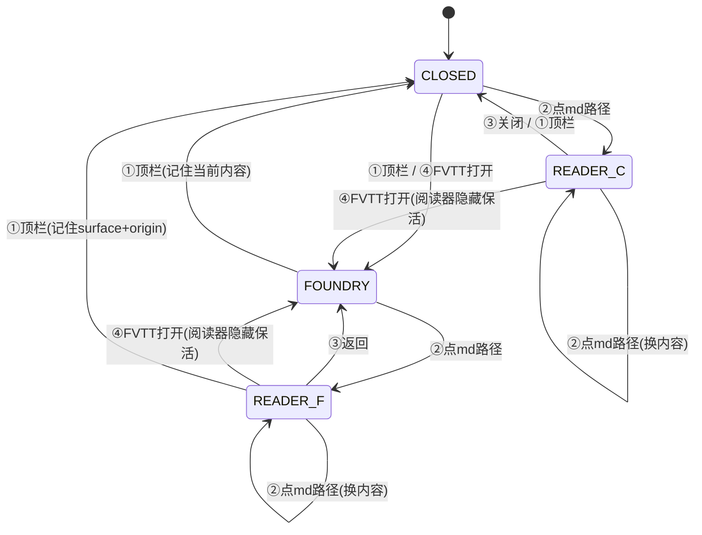

# Markdown 阅读器（备团笔记面板）

日期：2026-09-09。状态：实施中。

2026-09-10 修订（对着代码核过后的四处补漏）：阅读器页 CSP 基准、相对路径 resolve 基准、F5/`panel:reload` 的 surface 感知语义、main.js 里四处直摸 `foundryView` 的代码收编入控制器。修订点在下文就地标注，不另开变更记录。

chat 中 agent 产出的 `.md` 路径变为可点击；点击后，Markdown 阅读器占用右屏 Foundry 面板的位置展示该文件。本文是唯一设计方案，约束"怎么加"的规则见 [design-rules.md](design-rules.md)（下称 R1–R5），架构基线见 [architecture.md](architecture.md)。

## 1. 目标与非目标

目标：

- chat 里出现的 `.md` / `.markdown` 路径（裸文本或 Markdown 链接形式）可点击；
- 点击后在右屏面板位置打开阅读器，渲染该文件；
- 阅读器与 Foundry 页面互斥共存于右屏，切换瞬时、双方页面状态都不丢。

非目标（明确不做，评审通过前不得回潮）：

- 不做 tab 条、不多份笔记并存、不在顶栏加任何新按钮；
- 不在阅读器被 Foundry 顶掉时往 chat 推系统消息（"顶掉就顶掉"，回看入口是 chat 里原有的路径）；
- 不做战斗模式门禁——状态机模式无关（见 §4.4）；
- 不做编辑、不做文件监听热重载（重复点击 = 重新读取，即手动刷新）。

## 2. 架构前提（决定方案形态的事实）

右屏 Foundry 面板是 main 进程的 `WebContentsView`（`main.js` 的 `openFoundryView`），原生压在整窗 chat 渲染层之上，renderer DOM 任何 z-index 都盖不住它。布局由 main 侧 `layoutViews()` 计算 bounds，chat 页面靠 `panel_layout` 事件设置 `margin-right` 让出右屏。

因此阅读器**必须也是 main 侧的一个 `WebContentsView`**（下称 readerView），加载本地 `renderer/md-reader.html`。两个 view 同一时刻最多一个可见，切换只做显隐，不销毁对方——Foundry 页面重建昂贵（加载 + 会话），阅读器重建廉价（读文件 + 渲染），但保活成本同样极低，保活换来重复点击时的瞬时恢复（滚动位置保留）。

保活的适用范围只有两处：④ 被 Foundry 顶掉、以及阅读中换笔记。这两种情况 readerView 一直挂着，滚动位置与渲染结果原样保留。① 关面板**不**保活——`panel:close` 语义是"整个右屏收起"，两个 view 都销毁（与现状对齐）；重开时按 `lastContent` 恢复指的是重新读文件、重新渲染，滚动位置不保。两处不要混成一个机制。

复用清单与新增依赖：

| 能力 | 复用 |
|---|---|
| Markdown 渲染 | `window.arcaneMd.render`（`markdown.js`）：marked lexer + 手工 DOM（无 innerHTML）、KaTeX、hljs、mermaid |
| 右屏自定义页面样板 | `foundry-unavailable.html`（loadFile + query 传 theme/locale） |
| 面板区域生命周期 | `panel:open` / `panel:close` 与 `panel_layout` / `panel_status` 事件 |
| 主题/i18n | `resolveTheme()` / `resolveLocale()` / `ARCANE_MESSAGES`，query 传入 |

新增依赖：**零**。全部渲染能力（marked / KaTeX / hljs / mermaid）均已 vendor 在 `generated/renderer-assets/`。md-reader.html 与 index.html 同在 `src/renderer/`，因此 `../../generated/renderer-assets/...` 的相对引用原样可用，`scripts/prepare-renderer-assets.mjs` 与 electron-builder 的 `files` 白名单（已含 `src/**/*`）均无需改动。

## 3. 状态机

### 3.1 状态定义

```
状态 = 面板(开/关) × 当前内容(foundry / 笔记) × origin(打开笔记时下面有没有 foundry)
```

- `CLOSED`：右屏关闭，chat 全屏；
- `FOUNDRY`：右屏开，显示 foundryView；
- `READER_F`：右屏开，显示 readerView，origin=foundry（下面压着活的 Foundry）；
- `READER_C`：右屏开，显示 readerView，origin=closed（打开笔记时面板本是关的，下面没有 Foundry）。

`origin` 是阅读器本次打开周期的属性：阅读中换笔记不重置；阅读器被退出（回到 FOUNDRY 或 CLOSED）后再开，重新快照现场。

### 3.2 事件（只有四个入口）

1. **① 顶栏「面板」按钮**：右屏唯一的 chrome 开关。开/关右屏；重新打开时恢复关闭前的当前内容（reader 侧 = 重读文件重渲染，见 §2 保活范围）。
2. **② 点 chat 里的 md 路径**：内容寻址。当前内容 = 该笔记；面板关着则顺带打开；快照 origin；阅读中再点 = 原地换内容。
3. **③ 阅读器内返回/关闭按钮**：退出阅读。origin=foundry → 回 FOUNDRY；origin=closed → 关面板（CLOSED）。永不触发 FVTT 加载。
4. **④ FVTT 打开**（agent `foundry_open`、切战斗模式，以及任何使 foundryView 变为可见的路径）：当前内容 = foundry，面板开；阅读器若在场则隐藏保活，不销毁、不通知。

### 3.3 状态图



### 3.4 转移表

| 当前 | ①顶栏 | ②点 md 路径 | ③返回 | ④FVTT 打开 |
|---|---|---|---|---|
| CLOSED | FOUNDRY（恢复关闭前内容） | READER_C | — | FOUNDRY |
| FOUNDRY | CLOSED | READER_F | — | （已在） |
| READER_F | CLOSED（记住 reader+origin） | READER_F（换内容） | FOUNDRY | FOUNDRY（阅读器隐藏保活） |
| READER_C | CLOSED（记住 reader+origin） | READER_C（换内容） | CLOSED | FOUNDRY（阅读器隐藏保活） |

### 3.5 不变量（实现即断言）

1. 任一时刻右屏最多一个 view 可见；该不变量的唯一执行者是新增的 panel-surface 控制模块（R2），main.js 其余代码只调它的公开动词。
2. `READER_F` ⟹ foundryView 活着；③返回只做显隐切换，永不加载 FVTT。
3. `READER_C` ⟹ 打开时 foundryView 不存在；③只能是关面板。
4. 阅读器状态全在内存，不落盘；崩溃/重启后回到 CLOSED，无需对账（R1）。
5. readerView 的内容只由 main 侧单一 payload 推送：`did-finish-load` 与 `showReader()` 共用一条 `pushReaderContent()`。页面自身不持久化、不自行读盘，因此 Chromium 默认 F5 重载页面后内容必然回来，无需为刷新另设通道。

## 4. 交互语义

### 4.1 入口收敛原则

「打开右屏」与「选择看什么」解耦：顶栏按钮只管右屏开/关；内容选择权在 chat（md 路径）与 agent（foundry_open）。不新增任何 chrome。

### 4.2 路径点击（②）

- assistant 消息经 `markdown.js` 渲染后做 post-process：遍历文本节点，匹配 `.md` / `.markdown` 结尾的路径，包成 `<a class="md-path">`；
- 覆盖形态：相对路径、绝对路径（含 Windows 盘符）、反引号/引号包裹、`路径:行号`（行号 v1 仅剥除不跳转）；Markdown 链接（`[文字]` 紧跟 `(笔记.md)`）在 link 渲染处直接产出可点锚点（`safeUrl` 的非 http 剥除逻辑对 `.md` 结尾的 href 放行并转为此锚点）；
- 匹配不到/解析失败 = 保持纯文本，无回归面；
- 相对路径的 resolve 基准 = **当前活动会话的工作目录**（`host.cwd()`）；取不到时退回备团工作目录（`prepUiCwd()`）。战斗模式下同样按此规则：一律用 prep cwd 会让战斗会话里的相对路径静默解析到别的目录、落"文件不存在"错误页，而用户看不出原因。绝对路径不受基准影响，只过 §7 的围栏。

### 4.3 阅读器页内 chrome（③）

页面顶部一条窄栏：左侧返回/关闭按钮（origin=foundry 显示「← 返回 Foundry」，origin=closed 显示「✕ 关闭」，文案即语义），同行右侧文件名。Esc 等价于该按钮。此外页内无任何控件。

刷新不是新控件：既有 F5 快捷键（chat.js 绑 `panel:reload`）改为 **surface 感知**——surface=foundry 走原 `loadFoundryPage`；surface=reader 重读当前文件并重新推送，正是 §1 非目标里"重复点击 = 重新读取，即手动刷新"的同一个动作。焦点在 readerView 内时 F5 由 Chromium 默认重载接管，内容按 §3.5 不变量 5 自动回来。这样 `panel:reload` 在 `READER_C` 下不再返回 `{ ok: false }` 静默哑掉（现状 main.js:1454 的 `if (!foundryView) return { ok: false }` 会撞 R5）。

### 4.4 模式无关（机制一致）

状态机不感知 prep/combat，不加任何 mode gate。战斗模式里 md 路径同样可点——点击即意图，阅读器不抢焦点、不锁资源，agent 对 Foundry 的操作照常，一次 `foundry_open` 即切回。"战斗模式不加阅读器"的实现方式是**不往战斗模式加任何代码**，而不是加一道门禁。切模式本身不改变 surface：prep 里正读笔记切到 combat，阅读器原地保留；agent 开战叫 `foundry_open` 时按 ④ 归位。

## 5. 视觉设计

设计命题：chat 是**对话**，笔记是**文档**。阅读器页面要让用户一眼知道自己从"聊"切换到了"读"，但元素全部沿用现有主题变量，不引入新 chrome 色彩。

### 5.1 Tokens

- 底色：跟随主题（light `#f5f1e2` 羊皮纸 / dark `#171c26` nord），不另起表面色——右屏本来就是"一块地方"，再叠卡片会显得像弹窗；
- 文字：沿用主题前景（light `#71664f` / dark `#b9b4a7` 系）；
- 发丝线：`currentColor` + 低透明度，明暗主题自适应；
- 字号阶梯：正文 15px/1.8，页眉文件名 13px，正文字号即舒适阅读下限。

### 5.2 布局

```
┌────────────────────────────────────────────┐
│ ← 返回 Foundry            npc-张三.md      │  ← 窄顶栏：按钮(左) + 文件名(右,衬线)
├────────────────────────────────────────────┤  ← 发丝线
│                                            │
│        （正文栏，max-width 68ch 居中）       │
│                                            │
│        # NPC：张三                          │
│        正文 15px/1.8 …                     │
│                                            │
└────────────────────────────────────────────┘
```

### 5.3 Signature（本设计唯一冒险处）

**文件名用衬线**（Georgia / "Songti SC" / serif，字距略开），衬以发丝线，做成书页天头 running head 的样子。这个界面其余部分（含 chat）完全无衬线，此处破例一次，理由：它是"文档"唯一需要的身份信号。正文仍用系统无衬线栈（CJK 屏显衬线在 Windows 上质量不可控，不为招牌元素赌正文可读性）。其余一切——代码高亮、表格、公式、图——就是 `arcaneMd.render` 的既有输出，零再设计。

### 5.4 质量底线

无进入动画（瞬时切换本身就是体验）；按钮可见键盘焦点；`prefers-reduced-motion` 下无任何动效；窄栏时正文栏 padding 收缩，不出现横向滚动。

### 5.5 文案（进 `messages.js`，过 R3 投影层与黑名单 lint）

| 场景 | 文案（zh） |
|---|---|
| 返回（origin=foundry） | ← 返回 Foundry |
| 关闭（origin=closed） | ✕ 关闭 |
| 文件不存在 | 找不到这份笔记：文件不存在或已被移动。可以让 agent 重新生成它。 |
| 路径越界 | 这份笔记不在当前工作目录内。阅读器只读取工作目录里的文件。 |
| 超限截断 | 文件超过 2 MB，只显示开头部分。 |
| 非 UTF-8 | 这个文件不是 UTF-8 文本，无法阅读。 |

错误不道歉、不含糊、给下一步（R3/R5）；错误也渲染在阅读器页面里（不在 chat 弹任何东西）。

## 6. 渲染管线与文生图

Markdown 主包不换：marked 18（已 vendor）+ 手工 DOM 管线。文生图统一走 **fence 渲染器注册表**：`markdown.js` 在围栏代码块分发处按 language 查注册表，命中即渲染，未命中保持源码块。注册表挂在渲染管线本体上，chat 气泡与阅读器两处同时生效，扩展新图类型 = 加一条注册项。

| fence 语言 | 渲染器 | 网络 | 说明 |
|---|---|---|---|
| `mermaid` | mermaid 11（现有） | 无 | 本地渲 SVG，零成本 |

**只支持纯离线渲染，且只支持 mermaid 一种**：渲染器覆盖的图类型以"agent 实际会写、DM 实际会读"为准——mermaid 已覆盖流程图、时序图、状态图、ER 图、甘特图。未命中注册表的围栏一律保持源码块（管线缺省行为，无需降级逻辑）。服务器通道（PlantUML Server / Kroki）与本地 JVM 渲染的否决理由见 §10。

## 7. IPC 与安全围栏

边界只有一条：renderer → main 的 `md-reader:open`（信任边界 ①，输入校验只在此处，R1 规则）。

新增：

```ts
// preload.cjs（chat 侧）
openMdReader(path: string): Promise<{ ok: boolean; error?: string }>

// readerView 专用小 preload（新文件 preload-reader.cjs，contextIsolation）
arcaneReader.onContent(cb: (payload: { name, text, truncated, error? }) => void)
arcaneReader.onTheme(cb: (theme: string) => void)   // 主题切换广播时一并下发
arcaneReader.back(): void                            // ③ 按钮
```

main 侧 `md-reader:open` 处理链（每步失败都落入 §5.5 的错误页，不静默）：

1. `isTrustedChatIpc(event)` 校验来源；
2. 规范化路径（剥行号、反引号、引号），按 §4.2 的基准 resolve（当前会话 cwd → `prepUiCwd()` 兜底）；
3. 围栏：resolve 结果必须落在**第 2 步用的同一个基准目录**内、后缀必须 `.md`/`.markdown`——围栏失败走错误页而非拒绝无声（R5：用户的点击意图必须得到响应）；
4. 读文件：UTF-8，上限 2 MB，超限截断并置 `truncated`；
5. panel-surface 控制器执行 ② 转移，readerView 加载/复用后 `send` 内容。

`md-reader:back`（来自 readerView 的 preload）：按 origin 执行 ③。

`panel:reload`（既有 F5，chat.js:3045）改为 surface 感知：foundry → `loadFoundryPage`；reader → 重读当前文件 + `pushReaderContent()`，见 §4.3。

## 8. 实现结构

新增 `src/main/panel-surface-controller.js`（状态机唯一 owner，R2）：

- 持有 `surface: "foundry" | "reader"`、`origin`、`lastContent`（含关闭前的恢复信息）、`readerPayload`（当前笔记内容，§3.5 不变量 5）；
- 公开动词：`openPanel()`（①开）、`closePanel()`（①关）、`showReader(path)`（②）、`leaveReader()`（③）、`showFoundry()`（④，供 `openFoundryView` 等所有 foundry 显示路径调用）、`reloadSurface()`（F5，surface 感知）、`activeView()`（供 bounds 分发、分栏拖拽、指针转发消费"当前可见 view"）；
- 内部负责两个 view 的创建/显隐/销毁与 `layoutViews()` 的 bounds 分发；
- `layoutViews()` 改为向"当前可见 view"发 bounds，双 view 同步更新避免切换闪烁；
- `panel:close` 语义保持"整个右屏收起"（两个 view 都销毁，与现状对齐），重开按 `lastContent` 恢复。

main.js 里现存四处直接摸 `foundryView` 的代码必须一并收进控制器，否则 readerView 可见时会静默失效：

| 现存代码 | 位置 | 收编后行为 |
|---|---|---|
| `panel:set-chat-width` → `layoutViews()` | main.js:1468 | bounds 发给 `activeView()` |
| `panel:drag-start` / `drag-end` → `setIgnoreMouseEvents` | main.js:1477-1493 | 作用于 `activeView()`，否则拖分栏时指针划过 readerView 会断流 |
| `before-mouse-event` → `panel_pointer` | main.js:350-352 | readerView 同样绑定，点阅读器也要能收起覆盖式抽屉 |
| `foundryRuntime` 的 view getter | main.js:85 | 仍只解析 foundryView（direct-foundry-runtime 的 evaluate/screenshot 绝不能落到 readerView 上），但 view 生命周期改由控制器告知 |

变更清单：

| 文件 | 变更 | 量级 |
|---|---|---|
| `src/main/panel-surface-controller.js` | 新建：状态机 + 双 view 生命周期 | ~200 行 |
| `src/main/main.js` | 接线：`md-reader:open/back` IPC、`layoutViews` 走控制器、`panel:open/close/reload` 与 `openFoundryView` 委托控制器、上表四处 `foundryView` 直摸点收编 | ~110 行改 |
| `src/main/preload-reader.cjs` | 新建：readerView 的三方法桥 | ~20 行 |
| `src/renderer/md-reader.html` / `md-reader.js` | 新建：阅读器页（**CSP 对齐 index.html 的 `default-src 'self'` 并补 `font-src 'self'`**，不得抄 foundry-unavailable 的 `default-src 'none'`——那会掐掉 KaTeX 字体使公式渲染成方块；引 marked/katex/hljs/mermaid 本地资源 + `markdown.js`，顶栏 + 正文栏） | ~180 行 |
| `src/renderer/markdown.js` | `.md` 链接锚点 + 裸路径 post-process + fence 渲染器注册表（mermaid 迁入） | ~110 行 |
| `src/renderer/chat.js` | 消息体点击委托 → `openMdReader` | ~20 行 |
| `preload.cjs` | `openMdReader` | ~5 行 |
| `src/shared/i18n/messages.js` | §5.5 文案键（zh/en） | ~20 行 |
| `test/` | 路径正则、围栏 resolve、状态机转移、fence 分发、面板切换 smoke | ~220 行 |

renderer chat 侧对 `panel_layout` / `panel_status` 的处理零改动（事件协议不变）。

## 9. 测试与验收

- 单测（`node --test`）：路径匹配正则全形态；围栏 resolve（目录内/越界/盘符/行号）；状态机四态 × 四事件全转移表；fence 注册表分发与未知语言保持源码块；
- smoke：仿 `smoke-panel-ui.mjs`，起真实窗口验证 ② 打开、③ 两分支、④ 顶掉与瞬时唤回；
- 门禁：`npm run verify:source && npm test` 全绿；
- 手测清单：三种主题/语言组合下的阅读器页；含 mermaid 围栏的笔记渲染；2MB+ 文件截断提示；删除中的文件点击报错页；分栏拖拽/resize/F11 全屏下双 view 切换无闪烁。

## 10. 被否决方案存档

| 方案 | 否决原因 |
|---|---|
| renderer DOM 覆盖 Foundry 区域 | 原生 WebContentsView 压一切 z-index，物理不可行 |
| `foundryView.loadFile()` 原地换内容 | 切回 Foundry 需整页重载，丢会话状态 |
| 顶栏加「笔记」按钮做 surface 对切 | 新增 chrome；"打开右边的入口已经够多了" |
| ④ 发生时往 chat 推系统消息 | "顶掉就顶掉"，回看走 chat 原有路径即可 |
| 战斗模式硬门禁 | 买到的是代码量和边界 bug；点击即意图，机制一致零门禁 |
| tab 条/多笔记并存 | 复杂度上台阶；出现"同时对照两份笔记"的真实需求再演进 |
| PlantUML Server / Kroki 服务器通道 | 依赖网络与外部服务，与本地阅读器定位不符；本地 JVM 渲染归 agent 侧工具链 |
| dot/graphviz（viz.js） | 与 mermaid 的 flowchart/state 高度重叠，使用场景里没有它；需要时注册表加一条即可 |
